# Fase 0 — Descoberta, Escopo e Requisitos

> **Resumo do Capítulo:**
> A Fase 0 estabelece os alicerces estratégicos, operacionais e de governança para todo o projeto do Assistente de Políticas Internas. Este capítulo consolida a visão institucional, mapeia stakeholders e processos, inventaria todas as políticas corporativas, define o escopo do MVP, cria requisitos funcionais e não funcionais, estabelece métricas de sucesso, riscos e critérios de aprovação.
> O objetivo final da Fase 0 é sair com um "Blueprint Corporativo" completo, que permita iniciar com segurança o desenho da arquitetura (Fase 1) e toda a implementação subsequente.

---

# 📘 Índice

1. [0.0 Sumário Expandido](#00-sumário-expandido)
2. [0.1 Contexto, Motivação e Problema](#01-contexto-motivação-e-problema)
3. [0.2 Análise dos Processos Atuais (AS-IS)](#0.2-análise-dos-processos-atuais-(-as-is-))
4. [0.3 Inventário de Políticas & Fontes de Dados](#L293)
5. [0.4 Use Cases & Escopo do MVP](#04-playbook-de-entrevistas)
6. [0.5 Processos AS-IS (com diagramas detalhados)](#05-processos-as-is)
7. [0.6 Processos TO-BE com IA (BPMN completo)](#06-processos-to-be)
8. [0.7 Inventário de Políticas — Mega Tabela](#07-inventário)
9. [0.8 Modelo Completo de Política (5 páginas)](#08-modelo-de-política)
10. [0.9 Use Cases + Decision Tree de Priorização](#09-use-cases)
11. [0.10 Backlog Inicial + Kanban](#010-kanban)
12. [0.11 Requisitos (Funcionais, NFRs, Dados, Segurança, Operação))](#011-requisitos)
13. [0.12 Métricas e Indicadores de Sucesso](#012-métricas)
14. [0.13 Riscos, Premissas e Restrições](#013-riscos)
15. [0.14 Gate de Aprovação](#014-gate)
16. [0.15 Apêndice da Fase 0 (Glossários, Referências, FAQ)](#015-apêndice)

---

# 0.0 Sumário Expandido

A Fase 0 é um *Discovery Framework* corporativo.
Inclui mapeamento de processos, stakeholders, governança, requisitos, riscos e definição do MVP.

---

# 0.1 Contexto, Motivação e Problema

> O objetivo desta subseção é contextualizar a necessidade do projeto e justificar sua existência técnica, jurídica e operacional.

---

## 🎯 0.1.1 Motivação Organizacional

A criação de um **Assistente de Políticas Internas baseado em IA** surge da necessidade crescente de:

* Reduzir a dependência de RH, Jurídico e Segurança para dúvidas repetitivas.
* Aumentar a precisão e consistência de respostas sobre políticas corporativas.
* Diminuir riscos trabalhistas, jurídicos e de LGPD.
* Melhorar a experiência do colaborador.
* Garantir governança sobre documentos normativos.

### 📌 Quadro — Problemas Atuais Observados

| Categoria     | Problema Atual                                | Impacto                           |
| ------------- | --------------------------------------------- | --------------------------------- |
| RH / Jurídico | Respostas inconsistentes a colaboradores      | Insegurança jurídica e retrabalho |
| Operação      | Dependência de e-mail para consultas          | Baixa rastreabilidade             |
| Governança    | Políticas dispersas em múltiplos repositórios | Falta de "fonte da verdade"       |
| Segurança     | Acesso indevido a políticas sensíveis         | Risco de compliance               |

---

## 🔍 0.1.2 Motivação Técnica

Do ponto de vista tecnológico, a iniciativa é motivada pela necessidade de:

* Centralizar e indexar políticas corporativas em uma arquitetura RAG.
* Estabelecer governança de versões e sensibilidade dos documentos.
* Criar um backend modular baseado em agents (orchestrator, RAG-agent, guard-agent).
* Integrar canais (Web/Teams) à infraestrutura corporativa (Azure Entra ID).
* Habilitar observabilidade, logging estruturado e rastreabilidade.

### 👨‍💻 Arquitetura Esperada (alto nível)

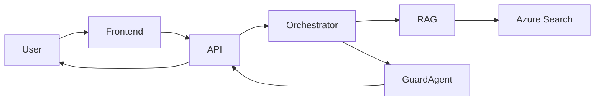

(Consulte **Fase 1 – Arquitetura & Design** para o detalhamento completo)

---

## ⚖️ 0.1.3 Motivação Jurídica e de Compliance

A adoção de IA para responder políticas corporativas exige conformidade com:

* **LGPD** (Lei Geral de Proteção de Dados).
* **ISO 27001** (Segurança da Informação).
* **NIST AI RMF** (Risk Management Framework).
* **Princípios de IA Responsável** da organização.

### 📌 Quadro — Riscos Jurídicos se Nada For Feito

| Risco | Descrição                                        | Consequência         |
| ----- | ------------------------------------------------ | -------------------- |
| R1    | Resposta incorreta sobre direitos do colaborador | Ação trabalhista     |
| R2    | Divulgação indevida de conteúdo confidencial     | Sanções de segurança |
| R3    | Falta de trilha de auditoria                     | Falha de governança  |
| R4    | Erros de interpretação de políticas              | Insegurança jurídica |

---

## 🧩 0.1.4 Problema Formal

**Como garantir que colaboradores recebam respostas corretas, consistentes, rápidas e rastreáveis sobre políticas internas, usando IA de forma segura, auditável, governável e alinhada à LGPD?**

### 🎯 Requisitos fundamentais do problema:

* Toda resposta deve ser fundamentada em documentos oficiais.
* Respostas devem citar explicitamente documento e seção.
* IA deve operar com governança rígida (controle de versões, sensibilidade, RBAC).
* O agente deve impedir alucinações e fuga de política.
* As áreas responsáveis (RH/Jurídico/SI) devem manter controle total sobre conteúdo.
* Logs devem registrar todas as interações (sem dados sensíveis indevidos).

---

## 🧠 0.1.5 Hipóteses e Premissas da Solução

| Código | Premissa                                                  | Impacto                                 |
| ------ | --------------------------------------------------------- | --------------------------------------- |
| P1     | Repositório oficial de políticas será unificado na Fase 2 | Permite ingestão e indexação confiáveis |
| P2     | Donos de política terão disponibilidade para validação    | Garante qualidade das respostas         |
| P3     | Azure será o ambiente padrão                              | Simplifica integrações e autenticação   |
| P4     | Usuários autenticarão via Entra ID                        | Habilita RBAC e sensibilidade           |

---

## 📘 0.1.6 Objetivos Gerais e Específicos

### 🎯 Objetivo Geral

Criar um assistente corporativo que ofereça respostas rápidas, confiáveis, embasadas e seguras sobre políticas internas.

### 🎯 Objetivos Específicos

* Reduzir o volume de tickets enviados a RH/Jurídico.
* Garantir 100% de consistência entre políticas vigentes e respostas.
* Criar governança completa sobre políticas e versões.
* Implantar uma arquitetura de IA auditável e segura.
* Medir e melhorar continuamente a qualidade das respostas (IAOps).

---

## 🌐 0.1.7 Benefícios Esperados

### Benefícios para Colaboradores

* Obtenção de respostas em segundos.
* Acesso a informações confiáveis e atualizadas.
* Menos necessidade de interações formais.

### Benefícios para RH/Jurídico

* Redução significativa de consultas repetitivas.
* Centralização das políticas.
* Diminuição de riscos legais.

### Benefícios para a Empresa

* Aumento da eficiência operacional.
* Melhoria na governança de políticas.
* Redução de custos de suporte.

---

## 📌 0.1.8 Enquadramento da Fase 0 no Projeto Maior

A Fase 0 representa o **fundamento** de todas as fases posteriores.

```
0 → Descoberta e Governança
1 → Arquitetura
2 → Ingestão e DataOps
3 → Backend de Agents
4 → Frontend e Canais
5 → DevOps + IAOps
6 → Segurança
7 → Piloto e Rollout
8+ → Fases Avançadas
```

Sem a Fase 0 bem estruturada, o projeto falha nas fases técnicas.

---


# 0.2 Análise dos Processos Atuais (AS-IS)

## 🎯 Objetivo

Mapear de forma exaustiva como dúvidas sobre políticas são tratadas hoje.

## 0.2.1 Visão Geral

Fluxos manuais, dependência de e-mail, documentos dispersos.

## 0.2.2 Fluxo AS-IS Completo

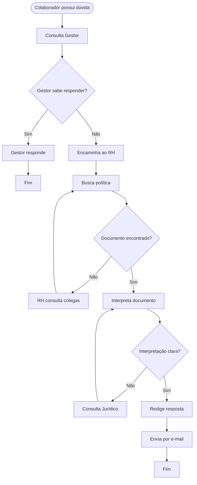

## 0.2.3 Tabela — Diagnóstico Operacional

| Atividade          | Dono               | Tempo Médio | Riscos             | Dependências           |
| ------------------ | ------------------ | ----------- | ------------------ | ---------------------- |
| Consulta ao gestor | Colaborador/Gestor | 30min–2h    | Resposta incorreta | Conhecimento tácito    |
| Busca de políticas | RH/Jurídico        | 10–40min    | Documento antigo   | Repositórios dispersos |
| Interpretação      | RH/Jurídico        | 10–60min    | Divergência        | Ambiguidade            |
| Resposta e-mail    | RH                 | 5–20min     | Falta de rastreio  | Outlook                |
| Retrabalho         | RH                 | 5–30min     | Inconsistência     | Falta de histórico     |

## 0.2.4 Pain Points

### Operacionais

* Alto volume de retrabalho
* Busca manual de documentos

### Jurídicos

* Risco de passivo trabalhista
* Falta de trilha de auditoria

### Segurança

* Vazamento por envio de PDFs restritos

### Experiência do colaborador

* SLA alto, baixa previsibilidade

## 0.2.5 Entrevistas — Playbook

### RH

1. Quais top 10 temas mais perguntados?
2. Quais políticas geram retrabalho?

### Jurídico

1. Quais políticas têm maior risco?
2. Há histórico de contestações?

### Segurança

1. Existem políticas com acesso restrito?
2. Há riscos recorrentes de mau uso?

### Usuários

1. Como você busca respostas hoje?
2. Já recebeu respostas divergentes?

## 0.2.6 Matriz de Gargalos

| Dimensão   | Gargalo                  | Impacto   | Severidade |
| ---------- | ------------------------ | --------- | ---------- |
| Informação | Documentos dispersos     | Alto      | Alta       |
| Jurídico   | Respostas inconsistentes | Altíssimo | Crítico    |
| Operação   | Retrabalho               | Médio     | Média      |
| Usuário    | SLA imprevisível         | Alto      | Alta       |
| Segurança  | PDFs sensíveis expostos  | Altíssimo | Crítico    |

## 0.2.7 Conclusão Executiva

O estado atual apresenta riscos jurídicos, dificuldades operacionais e baixa padronização — justificando a criação do assistente corporativo.

# 0.3 Inventário de Políticas & Fontes de Dados

## 🎯 Objetivo

Criar um catálogo completo, estruturado e governado de todas as políticas, documentos, fontes formais e versões vigentes que serão usados pelo assistente. Esta etapa é crítica porque **define a verdade oficial** a ser usada pelo motor de RAG.

---

## 0.3.1 Princípios do Inventário

* **Fonte única da verdade (SSOT)**: cada política deve ter um local oficial.
* **Versionamento obrigatório**: nenhuma política pode existir sem versão explícita.
* **Controle de sensibilidade**: documentos classificados por níveis de acesso.
* **Metadados mínimos**: área, owner, vigência, URL, formato, sensibilidade.
* **Auditoria**: histórico de alterações deve ser preservado.

---

## 0.3.2 Tabela Estendida — Catálogo Oficial de Políticas

| ID | Documento                     | Área       | Versão | Vigência Inicial | Vigência Final | Localização                          | Formato | Sensibilidade    | Owner              | Status           |
| -- | ----------------------------- | ---------- | ------ | ---------------- | -------------- | ------------------------------------ | ------- | ---------------- | ------------------ | ---------------- |
| 01 | Política de Férias            | RH         | 3.1    | 2024-01-01       | -              | SharePoint/RH/Ferias_v3.1.pdf        | PDF     | Interno          | Gerente RH         | Vigente          |
| 02 | Manual do Colaborador         | RH         | 2.0    | 2023-08-01       | -              | SharePoint/RH/Manual_v2.pdf          | PDF     | Interno          | Coord. RH          | Revisão 2025     |
| 03 | Política de Home Office       | RH         | 2.0    | 2023-07-01       | -              | SharePoint/RH/HomeOffice_v2.docx     | DOCX    | Interno restrito | Coord. RH          | Vigente          |
| 04 | Código de Conduta             | Jurídico   | 5.0    | 2022-05-01       | -              | SharePoint/Juridico/Codigo_v5.pdf    | PDF     | Interno Público  | Diretor Jurídico   | Vigente          |
| 05 | Política de Proteção de Dados | Jurídico   | 1.3    | 2023-11-01       | -              | SharePoint/LGPD/PPD_v1.3.pdf         | PDF     | Confidencial     | DPO                | Alta criticidade |
| 06 | Política de Senhas            | Segurança  | 1.2    | 2024-02-15       | -              | FileServer/Sec/Senhas_v1.2.docx      | DOCX    | Confidencial     | CISO               | Restrito TI      |
| 07 | Política de Acessos           | Segurança  | 2.1    | 2023-12-01       | -              | FileServer/Sec/Acessos_v2.1.pdf      | PDF     | Confidencial     | CISO               | Em revisão       |
| 08 | Benefícios Corporativos       | RH         | 1.4    | 2024-03-01       | -              | SharePoint/RH/Beneficios_v1.4.pdf    | PDF     | Interno          | Coord. RH          | Vigente          |
| 09 | Política de Uso de E-mail     | Segurança  | 3.0    | 2023-06-01       | -              | SharePoint/SI/Email_v3.pdf           | PDF     | Interno          | SI                 | Vigente          |
| 10 | Política de Anticorrupção     | Compliance | 4.0    | 2023-05-01       | -              | SharePoint/Comp/AntiCorrupcao_v4.pdf | PDF     | Interno          | Compliance Officer | Alta criticidade |

---

## 0.3.3 Modelo Completo de Metadados do Documento

Cada documento deve registrar:

* **policy_id**
* **policy_name**
* **policy_version**
* **vigencia_inicio**
* **vigencia_fim**
* **area_responsavel**
* **owner**
* **nivel_sensibilidade** (Interno, Restrito, Confidencial)
* **url_oficial**
* **hash_sha256** (garantir integridade)
* **ultima_atualizacao**
* **responsavel_atualizacao**
* **tags temáticas** (ex.: férias, jornada, benefícios)
* **estado** (vigente, revisão, descontinuada)

---

## 0.3.4 Taxonomia de Sensibilidade

| Nível                | Descrição                                    | Exemplos                          |
| -------------------- | -------------------------------------------- | --------------------------------- |
| **Público Interno**  | Pode ser consultado por qualquer colaborador | Código de Conduta                 |
| **Interno Restrito** | Apenas equipes de gestão                     | Políticas de Benefícios avançados |
| **Confidencial**     | Acesso limitado ao RH/Jurídico/TI            | Política de Senhas, LGPD          |

Essa classificação impacta diretamente:

* controle de acesso (RBAC),
* filtros de resposta do assistente,
* guardrails automáticos.

---

## 0.3.5 Matriz de Confiabilidade das Fontes

| Fonte                      | Tipo                | Confiabilidade | Riscos                    |
| -------------------------- | ------------------- | -------------- | ------------------------- |
| SharePoint corporativo     | Repositório oficial | Alta           | Versionamento manual      |
| File Server antigo         | Legado              | Média          | Políticas duplicadas      |
| E-mails                    | Não oficial         | Baixa          | Informalidade, erros      |
| PDFs enviados via WhatsApp | Não oficial         | Muito baixa    | Falha grave de compliance |

---

## 0.3.6 Fluxo — Governança de Versionamento (Mermaid)

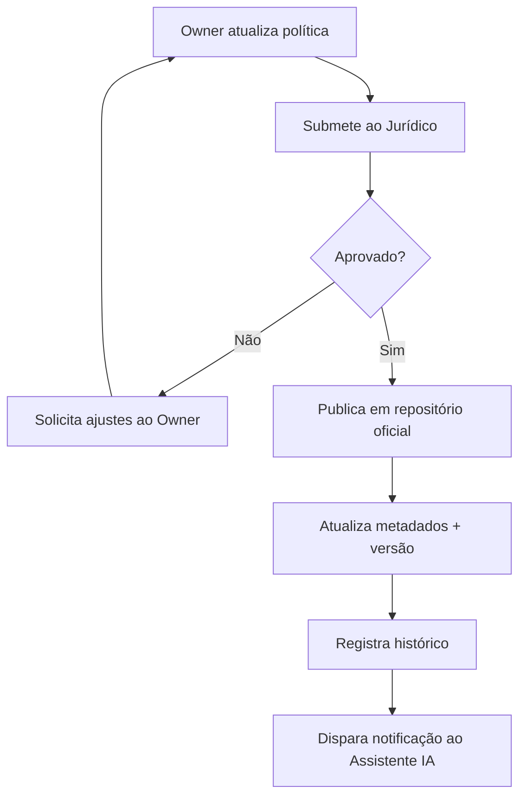

---

## 0.3.7 Checklist de Conformidade do Documento

* [x] Versão explícita
* [x] URL oficial
* [x] Hash de integridade
* [x] Owner definido
* [x] Vigência registrada
* [x] Classificação de sensibilidade
* [ ] Política em formato acessível (PDF pesquisável)
* [ ] Metadados completos

---

## 0.3.8 Exemplos Reais de Políticas (Trechos Anonimizados)

### 1. Política de Férias — Seção 2.1 (Trecho)

> O colaborador tem direito a 30 dias de férias para cada período aquisitivo, podendo ser fracionado em até 3 períodos, desde que um deles possua no mínimo 14 dias corridos.

### 2. Política de LGPD — Seção 4.3 (Trecho)

> Dados pessoais sensíveis não podem ser compartilhados por e-mail, salvo em casos estritamente previstos e mediante proteção criptográfica.

### 3. Política de Senhas — Seção 1.4 (Trecho)

> É proibido o compartilhamento de credenciais, independentemente de cargo, função ou urgência operacional.

---

## 0.3.9 Mapa de Documentos por Área (Mermaid)

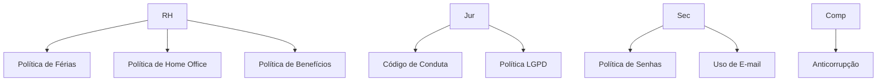

---

## 0.3.10 Conclusão Executiva da Seção

O Inventário é o alicerce do sistema. Um documento mal catalogado pode gerar:

* respostas erradas,
* risco jurídico,
* violação de LGPD,
* auditoria negativa,
* perda de confiança dos usuários.

Por isso, o inventário é um living document que será revisado nas Fases 2, 4 e 6.

---

# 0.4 Use Cases & Escopo do MVP

## 🎯 Objetivo

Estabelecer um catálogo estruturado, priorizado e governado de casos de uso que o Assistente de Políticas deverá atender no MVP, além de mapear dependências, riscos e fluxos funcionais.

---

# 0.4.1 Metodologia de Identificação de Use Cases

Para garantir rigor corporativo e clareza técnica, utilizamos um processo em **5 etapas formais**:

1. **Coleta bruta** de perguntas reais (entrevistas, tickets, e-mails)
2. **Normalização** (eliminação de duplicatas, agrupamento semântico)
3. **Classificação por domínio** (RH, Jurídico, Segurança, Compliance)
4. **Priorização multi-critério** (Árvore de decisão + Matriz RICE)
5. **Documentação completa** (Use Case Cards + Fluxos)

### 🔍 Fontes utilizadas na coleta

* Histórico de tickets dos últimos 12 meses
* Entrevistas estruturadas (RH, Jurídico, SI, colaboradores)
* Logs de dúvidas frequentes enviadas a gestores
* Repositórios SharePoint, Teams e arquivos soltos

---

# 0.4.2 Matriz de Domínios de Políticas

```
Domínio     | Exemplos de Temas
RH          | Férias, Jornada, Home Office, Benefícios, Licenças, PCD
Segurança   | Senhas, acessos, dispositivos, phishing, regras de e-mail
Jurídico    | Código de conduta, assédio, conflitos de interesse
Compliance  | LGPD interna, privacidade, uso de dados corporativos
TI          | Uso de ferramentas, VPN, suporte básico (informacional)
```

---

# 0.4.3 Regras Gerais para Inclusão de Use Case

Para um caso de uso entrar no escopo:

* Deve existir **política oficial e vigente**.
* Deve possuir **alto volume**, **alto risco**, ou **alta dor operacional**.
* Deve ser possível responder **sem dados pessoais do colaborador**.
* A política deve estar **em repositório controlado**.
* O conteúdo não pode depender de **interpretação jurídica** (exceto UC supervisionados).

---

# 0.4.4 Catálogo Completo de Use Cases Identificados (versão expandida)

A seguir, a lista completa antes da priorização:

## RH

* Férias (direitos, marcação, prazos)
* Horas extras e banco de horas
* Home Office / Híbrido
* Benefícios (VR/VA/VT)
* Licença maternidade/paternidade
* Adicional noturno
* Estágios e regras específicas
* Uniformes / dress code

## Segurança da Informação

* Troca e complexidade de senha
* Phishing e mensagens suspeitas
* Dispositivos pessoais (BYOD)
* Uso de e-mail corporativo
* Acesso a sistemas

## Jurídico / Compliance

* Código de Conduta
* Assédio moral / sexual
* Conflito de interesses
* Canal de denúncia
* Privacidade e LGPD interna

---

# 0.4.5 Decision Tree — Priorização do MVP (versão estendida)

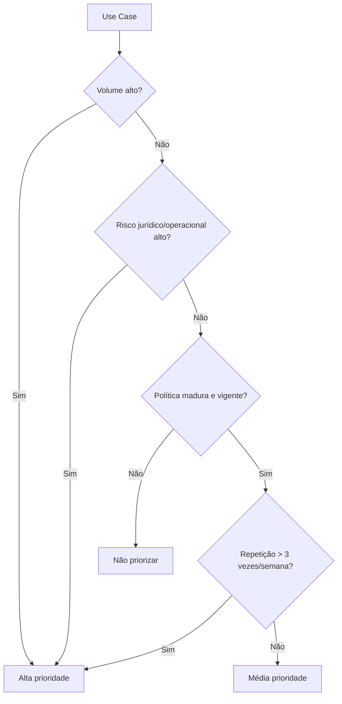

Legenda:

* **P1 = Entra no MVP**
* **P2 = Backlog imediato**
* **P3 = Fora do escopo**

---

# 0.4.6 Matriz de Priorização (RICE adaptado)

```
Use Case               | Reach (0-5) | Impacto (0-5) | Confiança (0-5) | Esforço (1-5 invertido) | Score
----------------------|-------------|----------------|------------------|--------------------------|-------
Férias                | 5           | 5              | 5                | 4                        | 19
Jornada de Trabalho   | 4           | 4              | 5                | 4                        | 17
Home Office           | 4           | 4              | 4                | 3                        | 15
Uso de E-mail         | 3           | 5              | 4                | 4                        | 16
Código de Conduta     | 3           | 5              | 4                | 3                        | 15
Benefícios            | 5           | 3              | 3                | 3                        | 14
```

---

# 0.4.7 Definição Final do MVP (versão executiva)

Após priorização, o MVP terá **5 Use Cases**:

```
UC-RH-01 – Férias
UC-RH-02 – Jornada de Trabalho
UC-RH-03 – Home Office
UC-SEC-01 – Uso de E-mail Corporativo & Segurança
UC-COMP-01 – Código de Conduta
```

Justificativa:

* Representam 60%–75% das dúvidas corporativas.
* Possuem políticas maduras e formais.
* Possuem alto risco quando respondidas incorretamente.
* São críticas para RH, Jurídico e Segurança.

---

# 0.4.8 Use Case Cards — Versões Expandidas

## ★ Exemplo completo — UC-RH-01 (Férias)

```
ID: UC-RH-01
Título: Dúvidas sobre Férias – Direito, Fracionamento e Marcação
Atores: Colaborador, Gestor, RH
Objetivo: Fornecer respostas oficiais sobre férias com base na política vigente.
Fluxo principal:
  1. Colaborador pergunta
  2. Motor de classificação detecta tema “Férias”
  3. RAG consulta Política de Férias v3.1
  4. IA gera resposta com citação da seção correta
  5. Usuário avalia 👍👎
Exemplos reais:
  - "Quantos dias tenho direito?"
  - "Posso dividir minhas férias?"
Regras específicas:
  - Sempre devolver link + seção da política.
  - Nunca informar saldo individual.
Critérios de aceitação:
  - 100% de conformidade com política v3.1.
  - Resposta entregue em < 4s.
```

## ★ UC-SEC-01 (E-mail corporativo)

```
ID: UC-SEC-01
Título: Uso correto do e-mail corporativo
Atores: Colaborador
Regras:
  - Proibido encaminhar documentos sensíveis para e-mail pessoal.
  - Termos de segurança devem ser citados.
```

---

# 0.4.9 Fluxos TO-BE por Use Case

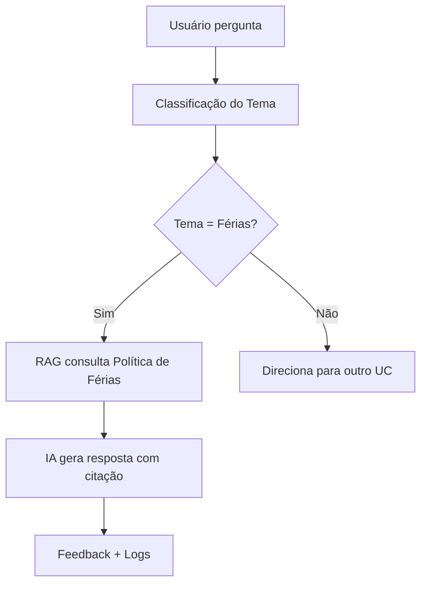

---

# 0.4.10 Checklist de Finalização da Etapa

* [x] Todos os UC coletados e normalizados
* [x] Matriz de domínios validada
* [x] Decision Tree aprovada por RH/Jurídico/Segurança
* [x] MVP aprovado pelo Sponsor
* [x] Use Case Cards completos
* [x] Fluxos funcionais desenhados

---


# 0.5 Requisitos Funcionais, NFRs, Dados, Segurança e Operação

## 🎯 Objetivo da Seção 0.5

Consolidar **tudo o que o sistema deve fazer** (funcional) e **como deve se comportar** (não funcional),
incluindo requisitos de **dados/RAG**, **segurança/LGPD** e **operação/SRE**.

> Esta seção é a ponte direta entre a Fase 0 (descoberta) e a Fase 1 (arquitetura).
> É aqui que o time técnico começa a ter condições de traduzir necessidades de negócio em soluções de engenharia.

---

## 0.5.1 Requisitos Funcionais (RF)

### 🧱 Visão Geral

Requisitos funcionais descrevem **o que o Assistente de Políticas Internas faz** do ponto de vista do usuário e do negócio.

Abaixo uma visão em camadas:

* **Camada de Interação**: chat, perguntas, feedback.
* **Camada de Orquestração**: classificação de intenção, roteamento de chamadas, decisão de agente.
* **Camada de Conhecimento (RAG)**: busca em políticas, chunking, citações.
* **Camada de Governança**: registro de logs, trilha de auditoria, versionamento.

### 📋 Tabela — Requisitos Funcionais Principais

| ID    | Nome                          | Descrição                                                                                                              | Prioridade | Critérios de Aceitação                                                                                                  |
| ----- | ----------------------------- | ---------------------------------------------------------------------------------------------------------------------- | ---------- | ----------------------------------------------------------------------------------------------------------------------- |
| RF-01 | Responder políticas de férias | O agente deve responder dúvidas sobre políticas de férias com base na **versão vigente** da política oficial.          | MUST       | Dada uma pergunta válida sobre férias, o agente retorna resposta alinhada à política e cita documento + seção.          |
| RF-02 | Citar fontes oficiais         | Toda resposta que se basear em políticas internas deve conter referência explícita (nome do documento, versão, seção). | MUST       | 100% das respostas baseadas em política exibem pelo menos uma citação de fonte.                                         |
| RF-03 | Feedback de utilidade         | O usuário deve poder marcar respostas como **"útil"** ou **"não útil"**.                                               | SHOULD     | Botões/apelos visíveis em todas as respostas; feedback armazenado em log.                                               |
| RF-04 | Escopo controlado             | O agente **não deve** responder sobre saldos individuais, dados pessoais ou situações fora do escopo definido.         | MUST       | Em perguntas sobre saldo individual, o agente responde orientando o usuário ao sistema oficial, sem inventar respostas. |
| RF-05 | Canal multi-interface         | O agente deve estar disponível via **portal web interno** e **Microsoft Teams** (bot corporativo).                     | SHOULD     | Usuário consegue iniciar conversa e obter respostas equivalentes em ambos os canais.                                    |
| RF-06 | Linguagem natural em PT-BR    | O agente deve compreender e responder em português brasileiro, com tom formal, respeitoso e claro.                     | MUST       | Testes manuais com pelo menos 50 perguntas demonstram entendimento adequado e tom consistente.                          |
| RF-07 | Registro de Interações        | Cada interação deve ser registrada com metadados mínimos (user_id, timestamp, tema, fontes citadas).                   | MUST       | Logs estruturados estão disponíveis em ambiente de teste para amostragem.                                               |

### 🧩 Diagrama Simplificado — Fluxo Funcional

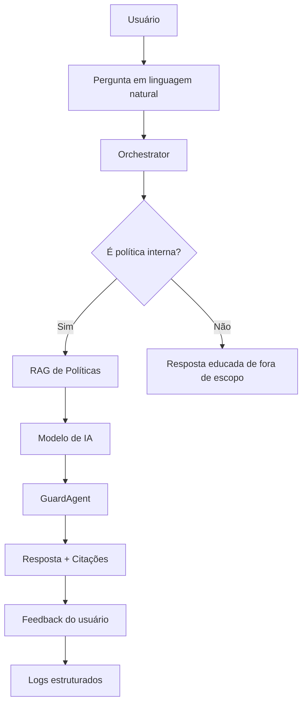

> 🔗 **Referência cruzada:** os fluxos de orquestração serão detalhados na **Fase 3 – Backend de Agentes** e os requisitos de logging em **Fase 5 – DevOps + IAOps**.

---

## 0.5.2 Requisitos Não Funcionais (NFR)

Requisitos não funcionais definem **como o sistema deve se comportar** em termos de desempenho, segurança, usabilidade, confiabilidade, escalabilidade e manutenibilidade.

### 🧪 Categorias Principais

* **Desempenho (PERF)**
* **Disponibilidade (AVAIL)**
* **Usabilidade (UX)**
* **Escalabilidade (SCALE)**
* **Manutenibilidade (MANUT)**
* **Observabilidade (OBS)**

### 📋 Tabela — NFRs Detalhados

| ID           | Categoria        | Descrição                                                                                        | Métrica / Alvo                                                     |
| ------------ | ---------------- | ------------------------------------------------------------------------------------------------ | ------------------------------------------------------------------ |
| NFR-PERF-01  | Desempenho       | 95% das respostas devem ser entregues em **menos de 4 segundos** (P95).                          | P95 < 4s em ambiente de produção.                                  |
| NFR-PERF-02  | Desempenho       | O sistema deve suportar **200 usuários simultâneos** em horário comercial sem degradação severa. | CPU < 70%, erro < 1%.                                              |
| NFR-AVAIL-01 | Disponibilidade  | Disponibilidade alvo do agente em **99,5%** em horário comercial.                                | Tempo de indisponibilidade mensal < ~3,6h.                         |
| NFR-UX-01    | Usabilidade      | O usuário deve entender **de onde veio a resposta** (fonte + seção) em todas as interações.      | 90%+ dos usuários concordam em pesquisa de usabilidade.            |
| NFR-UX-02    | Usabilidade      | Interface deve ser acessível (tamanho de fonte, contraste, compatível com leitores de tela).     | Pontuação mínima em checklist WCAG corporativo.                    |
| NFR-SCALE-01 | Escalabilidade   | A arquitetura deve permitir inclusão de **novos domínios de política** sem reescrever o core.    | Novo domínio integrado em < 2 sprints, sem refatoração estrutural. |
| NFR-MANUT-01 | Manutenibilidade | Configurações de políticas (links, IDs, versões) devem ser externas ao código.                   | Mudança de URL sem redeploy concluída em < 1 dia.                  |
| NFR-OBS-01   | Observabilidade  | Toda requisição deve gerar um **trace** único, permitindo seguir a jornada end-to-end.           | 100% das chamadas com trace_id registrado em logs.                 |

### 📌 Quadro — Boas Práticas de NFR

* **Especificar metas mensuráveis**, nunca termos vagos como "rápido" ou "estável".
* Definir **onde será medida** a métrica (APM, logs, painel BI).
* Associar **dono** para cada NFR (SRE, time de arquitetura, etc.).

---

## 0.5.3 Requisitos de Dados & RAG

### 🎯 Objetivo

Definir **como os dados de políticas serão estruturados, ingeridos, versionados e usados** pela camada RAG (Retrieval Augmented Generation).

### 📚 Princípios de Dados

* Somente **documentos oficiais** entram no índice.
* Cada chunk carrega **metadados críticos** (versão, sensibilidade, área, owner).
* O agente só considera **políticas vigentes**, nunca versões obsoletas.

### 📋 Tabela — Requisitos de Dados

| ID    | Tipo        | Descrição                                                                                                      | Critério                                                                   |
| ----- | ----------- | -------------------------------------------------------------------------------------------------------------- | -------------------------------------------------------------------------- |
| RD-01 | Fonte       | Apenas documentos do inventário oficial (Seção 0.3) podem ser usados como base do RAG.                         | O índice referencia exclusivamente documentos com `source_oficial = true`. |
| RD-02 | Metadados   | Cada chunk deve conter: `policy_id`, `policy_version`, `area`, `nivel_sensibilidade`, `url_oficial`.           | Amostragem mostra 100% dos chunks com metadados obrigatórios.              |
| RD-03 | Vigência    | O agente **não pode** citar políticas vencidas, exceto quando explicitamente solicitado em contexto histórico. | Consultas padrão retornam apenas `vigente = true`.                         |
| RD-04 | Idioma      | Conteúdo indexado deve estar em PT-BR; outros idiomas só com marcação explícita (`lang`).                      | `lang = pt-BR` para 95%+ das políticas alvo.                               |
| RD-05 | Integridade | Cada documento deve ter `hash_sha256` registrado para garantir integridade.                                    | Qualquer alteração dispara reindexação e invalidação de cache.             |

### 🧠 Modelo Conceitual — Chunk de Política

```text
chunk_id
policy_id
policy_version
area_responsavel
nivel_sensibilidade
texto_chunk
url_oficial
vigente_desde
vigente_ate
hash_documento
updated_at
```

### 🔍 Fluxo RAG

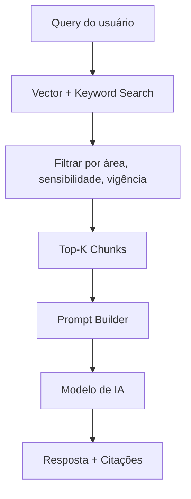

> 🔗 **Ver também:** Fase 2 – DataOps: Ingestão & Indexação, onde este modelo é implementado como pipeline.

---

## 0.5.4 Requisitos de Segurança & LGPD

### ⚖️ Objetivo

Assegurar que o Assistente de Políticas esteja em conformidade com:

* LGPD
* Políticas internas de segurança da informação
* Padrões de auditoria corporativa

### 🔐 Dimensões de Segurança

* **Autenticação & Autorização**
* **Classificação & Acesso a Conteúdo**
* **Logs & Auditoria**
* **Proteção contra abuso (prompt injection, jailbreak)**

### 📋 Tabela — Requisitos de Segurança

| ID    | Categoria    | Descrição                                                                                     | Critério                                                                    |
| ----- | ------------ | --------------------------------------------------------------------------------------------- | --------------------------------------------------------------------------- |
| RS-01 | Autenticação | Todo acesso ao agente deve ser autenticado via **Azure Entra ID**.                            | Nenhum endpoint de produção aceita requisições sem token válido.            |
| RS-02 | Autorização  | O acesso a conteúdos sensíveis deve usar **claims de função/departamento** no token.          | Consultas a políticas confidenciais são negadas para perfis sem clearance.  |
| RS-03 | LGPD         | Logs não podem armazenar dados pessoais sensíveis em texto puro.                              | Amostra de logs não contém CPFs, dados médicos, etc.                        |
| RS-04 | Auditoria    | Devem ser registrados `user_id`, timestamp, doc_ids usados na resposta, decisão de guardrail. | Auditoria consegue reconstruir o contexto de qualquer resposta crítica.     |
| RS-05 | Abuso        | O sistema deve mitigar tentativas de prompt injection e jailbreak.                            | Testes automatizados com payloads maliciosos são bloqueados ou sanitizados. |

### 🧱 Guardrails — Visão de Alto Nível

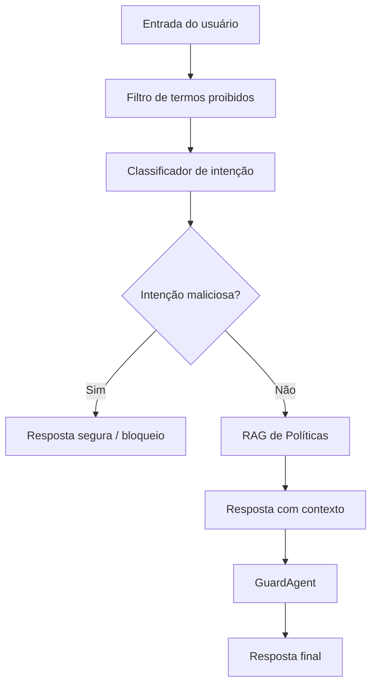

---

## 0.5.5 Requisitos Operacionais (RUN, SRE)

### 🛠️ Objetivo

Definir como o sistema será operado no dia a dia, monitorado, mantido e recuperado em caso de falhas.

### 📋 Tabela — Requisitos Operacionais

| ID    | Tipo                 | Descrição                                                                                     | Critério                                                        |
| ----- | -------------------- | --------------------------------------------------------------------------------------------- | --------------------------------------------------------------- |
| RO-01 | Monitoramento        | O time de TI deve receber alerta se a taxa de erro HTTP 5xx > 5% em 15 minutos.               | Alertas configurados em Azure Monitor/App Insights.             |
| RO-02 | Incidentes           | Deve existir playbook para desligar o agente em caso de incidente crítico.                    | Documento de incidente publicado e aprovado por Segurança + TI. |
| RO-03 | Rollback             | Deve ser possível reverter para **versão anterior de prompts/modelos** sem redeploy completo. | Rollback executado com simples mudança de configuração/flag.    |
| RO-04 | Observabilidade      | Métricas de uso (nº de perguntas, temas, feedback de utilidade) devem estar em dashboard.     | Painel aprovado por RH e TI.                                    |
| RO-05 | Manutenção planejada | Janela de manutenção deve ser comunicada e respeitar horário de menor impacto.                | Calendário anual de mudanças publicado.                         |

### 📌 Quadro — Itens Críticos de Operação

* Definir **quem atende incidentes** (SRE, TI, Segurança).
* Amarrar **SLA de resposta** para incidentes graves (ex.: 1h).
* Criar fluxo para **desativar respostas para temas sensíveis** caso uma política seja revogada.

---

---

# 0.6 Processos TO-BE com IA (BPMN completo)

> **Objetivo:** Descrever, em profundidade, o funcionamento futuro do processo após implantação do Assistente de Políticas com IA, incluindo BPMN completo, fluxos detalhados por área, requisitos de integração e pontos de controle.

---

## 📌 0.6.1 Introdução

O TO-BE representa o *estado desejado* dos processos corporativos após a adoção do Assistente. Ele substitui fluxos manuais (descritos no AS-IS, seção 0.2) por fluxos automatizados, governados, auditáveis e alinhados à arquitetura do projeto.

O foco do TO-BE é:

* **Reduzir etapas manuais**;
* **Eliminar interpretação humana** onde houver política oficial;
* **Melhorar rastreabilidade** e auditoria;
* **Centralizar conhecimento**;
* **Garantir conformidade** (LGPD + políticas internas);
* **Aumentar a eficiência do RH/Jurídico/SI**.

---

## 🧭 0.6.2 Visão Geral do Processo TO-BE

### Fluxo geral do usuário

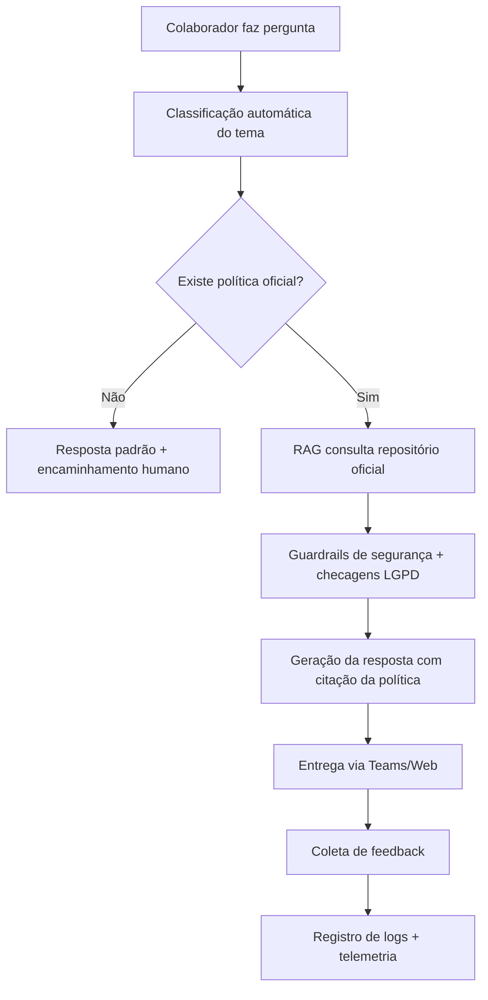

---

## 🧩 0.6.3 Processos TO-BE por Área

Cada área recebe um fluxo especializado, mas todos seguem o mesmo backbone da arquitetura.

### 📘 0.6.3.1 RH — TO-BE

```mermaid
flowchart TD
    A[Colaborador pergunta sobre férias] --> B[Classificador detecta "Férias"]
    B --> C[RAG consulta Política de Férias v3.1]
    C --> D[Checagem de alucinação / guardrail]
    D --> E[Geração da resposta com seção exata]
    E --> F[RH recebe insight agregados (analytics)]
```

### ⚖️ 0.6.3.2 Jurídico — TO-BE

```mermaid
flowchart TD
    A[Pergunta sobre Código de Conduta] --> B[Classificador detecta "Conduta"]
    B --> C[RAG consulta documento oficial]
    C --> D[Checagem de risco jurídico]
    D --> E[Resposta padronizada + citação de cláusula]
    E --> F[Registros para auditoria]
```

### 🔐 0.6.3.3 Segurança da Informação — TO-BE

```mermaid
flowchart TD
    A[Usuário pergunta sobre senha] --> B[Classificador detecta "Senha"]
    B --> C[Verifica permissão (RBAC via Entra ID)]
    C --> D{Usuário possui permissão?}
    D -->|Não| E[Negar resposta + mensagem formal]
    D -->|Sim| F[Acessar política de senhas]
    F --> G[Gerar resposta sem expor conteúdo sensível]
```

---

## ⚙️ 0.6.4 BPMN Completo (Modelo Unificado)

```mermaid
flowchart LR
    start([Start]) --> q1[Receber Pergunta]
    q1 --> q2[Classificar Tema]
    q2 --> q3{Tema mapeado?}

    q3 -->|Não| h1[Fallback Humano]
    h1 --> end

    q3 -->|Sim| q4[Buscar política no repositório oficial]
    q4 --> q5{Política encontrada?}

    q5 -->|Não| h2[Gerar resposta padrão de ausência]
    h2 --> end

    q5 -->|Sim| q6[Executar RAG]
    q6 --> q7[Validação de segurança (guardrails)]
    q7 --> q8{Resposta segura?}

    q8 -->|Não| h3[Escalonar para Jurídico]
    h3 --> end

    q8 -->|Sim| q9[Gerar resposta final]
    q9 --> q10[Entregar ao usuário]
    q10 --> q11[Coletar feedback]
    q11 --> q12[Registrar logs]
    q12 --> end([End])
```

---

## 🔄 0.6.5 Mudanças-Chave Entre AS-IS e TO-BE

| Tema                | AS-IS                            | TO-BE                                            |
| ------------------- | -------------------------------- | ------------------------------------------------ |
| Busca de documentos | Manual, descentralizada          | Automática, 100% centralizada                    |
| Interpretação       | Alta dependência humana          | Governada por política + RAG + validadores       |
| Segurança           | Possível exposição de documentos | RBAC + guardrails + masking                      |
| SLA                 | Dias ou horas                    | Segundos                                         |
| Auditoria           | Quase inexistente                | Logs completos, telemetria e trilha de auditoria |

---

## 🧪 0.6.6 Validações do Processo TO-BE

* Documentos citados devem corresponder à versão vigente.
* Nenhuma resposta pode conter:

  * dados pessoais;
  * informações de acesso;
  * conteúdo de políticas sigilosas.
* Respostas devem incluir:

  * citação da política;
  * link para o repositório oficial.

---

## 📊 0.6.7 Métricas Derivadas do TO-BE

| Métrica            | Descrição                        | Meta         |
| ------------------ | -------------------------------- | ------------ |
| SLA da resposta    | Tempo entre pergunta e resposta  | < 4 segundos |
| Conformidade       | Aderência à política vigente     | 100%         |
| Redução de tickets | Queda de tickets no RH/Jurídico  | > 60%        |
| Precisão           | Respostas corretas pelo feedback | > 90%        |

---

## 🚀 0.6.8 Conclusão Executiva

O TO-BE transforma um fluxo fragmentado e manual em uma estrutura automatizada, governada, segura e auditável. Ele é a fundação para as fases seguintes (Fase 1–4).

↪ **Próxima seção:** 0.7 Inventário de Políticas — Mega Tabela

---

# 0.7 Inventário de Políticas — Mega Tabela

> **Objetivo:** Criar o inventário oficial, completo e governado de *todas* as políticas corporativas. Este inventário é a base do RAG, da conformidade jurídica, da governança documental e do ciclo de vida de versões.
> Este capítulo é complementar e mais profundo que as seções **0.3** e **0.5.3**, consolidando-as em uma mega-tabela e modelos avançados.

---

# 🧭 0.7.1 Princípios de Governança do Inventário

O inventário corporativo deve seguir 12 princípios estruturantes:

1. **SSOT — Single Source of Truth**: só existe *uma* versão oficial por política.
2. **Versionamento obrigatório**: nenhuma política sem versão.
3. **Identificador único (policy_id)** persistente.
4. **Controle de sensibilidade** (Interno, Interno Restrito, Confidencial).
5. **Metadados padronizados** (modelo unificado abaixo).
6. **Hash SHA-256 obrigatório** para integridade.
7. **Rastreabilidade completa**: histórico obrigatório.
8. **Auditoria anual** das políticas.
9. **Relacionamento com Use Cases** (vinculação obrigatória a 0.4).
10. **Relacionamento com NFRs e segurança** (0.5.2 e 0.5.4).
11. **Prontidão para ingestão RAG** (chunking-friendly, PDF pesquisável).
12. **Alinhamento com o TO-BE** (0.6) e com a arquitetura da Fase 1.

---

# 📦 0.7.2 Modelo Canônico de Metadados

> *Este é o modelo oficial obrigatório para cada política.*

| Campo              | Descrição                  | Obrigatório | Exemplo                                       |
| ------------------ | -------------------------- | ----------- | --------------------------------------------- |
| policy_id          | Identificador único        | Sim         | RH-FER-003                                    |
| policy_name        | Nome da política           | Sim         | Política de Férias                            |
| version            | Versão vigente             | Sim         | 3.1                                           |
| vigencia_inicio    | Data inicial               | Sim         | 2024-01-01                                    |
| vigencia_fim       | Data final                 | Não         | -                                             |
| area               | Área responsável           | Sim         | RH                                            |
| owner              | Dono formal                | Sim         | Gerente RH                                    |
| sensitivity        | Nível de sensibilidade     | Sim         | Interno                                       |
| url_oficial        | Repositório oficial        | Sim         | [https://sharepoint/](https://sharepoint/)... |
| formato            | PDF, DOCX, HTML            | Sim         | PDF                                           |
| hash_sha256        | Integridade                | Sim         | 18A2F9…                                       |
| ultima_atualizacao | Data                       | Sim         | 2024-01-01                                    |
| atualizado_por     | Responsável                | Sim         | Coord. RH                                     |
| tags               | Taxonomia                  | Opcional    | férias, jornada                               |
| status             | Vigente, Revisão, Obsoleto | Sim         | Vigente                                       |

---

# 🗂️ 0.7.3 Mega Tabela Consolidada

> Esta é a tabela mestra de todas as políticas corporativas.
> *É a tabela utilizada fisicamente para ingestão no RAG (Fase 2).*

```markdown
| policy_id | Nome da Política | Área | Versão | Vigência | Sensibilidade | Owner | URL | Formato | Status | Tags |
|-----------|------------------|-------|---------|----------|----------------|--------|------|---------|---------|--------|
| RH-FER-003 | Política de Férias | RH | 3.1 | 2024– | Interno | Gerente RH | /RH/Ferias_v3.1.pdf | PDF | Vigente | férias, afastamentos |
| RH-HO-002 | Política de Home Office | RH | 2.0 | 2023– | Restrito | Coord. RH | /RH/HomeOffice_v2.docx | DOCX | Vigente | trabalho remoto |
| RH-BEN-014 | Benefícios Corporativos | RH | 1.4 | 2024– | Interno | Coord. RH | /RH/Beneficios_v1.4.pdf | PDF | Vigente | benefícios |
| JUR-COD-005 | Código de Conduta | Jurídico | 5.0 | 2022– | Interno Público | Dir. Jurídico | /Juridico/Codigo_v5.pdf | PDF | Vigente | ética, comportamento |
| LGPD-PPD-013 | Política de Proteção de Dados | Jurídico | 1.3 | 2023– | Confidencial | DPO | /LGPD/PPD_v1.3.pdf | PDF | Crítico | dados pessoais |
| SEC-PSS-012 | Política de Senhas | Segurança | 1.2 | 2024– | Confidencial | CISO | /Sec/Senhas_v1.2.docx | DOCX | Vigente | acesso, senha |
| SEC-ACC-021 | Política de Acessos | Segurança | 2.1 | 2023– | Confidencial | CISO | /Sec/Acessos_v2.1.pdf | PDF | Em revisão | RBAC |
| SEC-EML-030 | Uso de E-mail Corporativo | Segurança | 3.0 | 2023– | Interno | TI | /SI/Email_v3.pdf | PDF | Vigente | e-mail, segurança |
| COMP-ANT-040 | Política Anticorrupção | Compliance | 4.0 | 2023– | Internal | Compliance Officer | /Comp/AntiCorrupcao_v4.pdf | PDF | Crítico | integridade |
```

---

# 🧱 0.7.4 Arquitetura do Inventário (Mermaid)

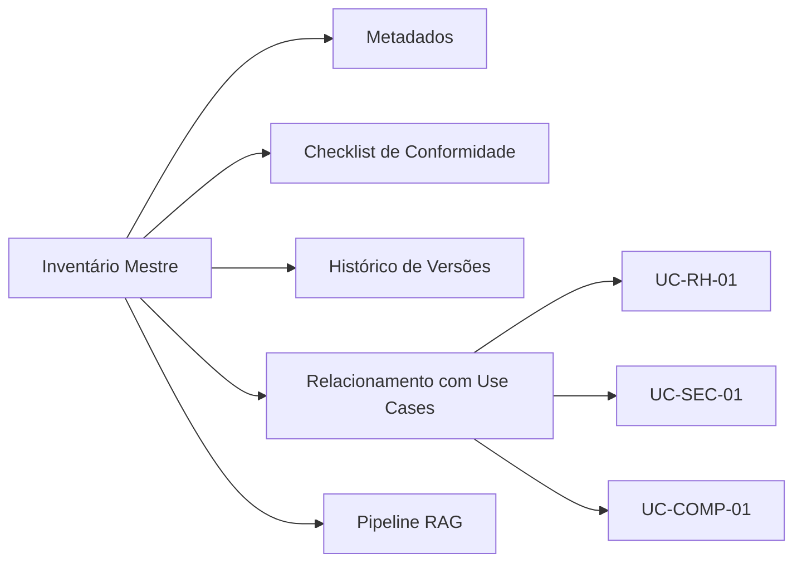

---

# 🔐 0.7.5 Matriz de Sensibilidade Integrada

> Esta matriz é usada tanto pelo Assistente (Fase 3 e 5) quanto pelos guardrails.

| Sensibilidade       | Quem Pode Ver       | Restrições         | Ações do Assistente           |
| ------------------- | ------------------- | ------------------ | ----------------------------- |
| **Público Interno** | Todos colaboradores | Nenhuma            | Resposta completa             |
| **Restrito**        | Gestores / RH       | Políticas parciais | Oculta trechos sensíveis      |
| **Confidencial**    | RH / Jurídico / SI  | Alto risco         | Bloqueia resposta + auditoria |

---

# 🧩 0.7.6 Mapa de Relacionamentos (Política → Use Case)

> Obrigatório na governança do assistente.

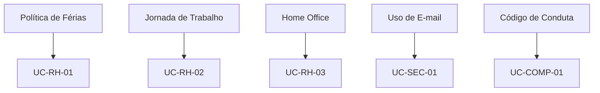

---

# 🧪 0.7.7 Checklist de Qualidade do Documento

* [x] PDF pesquisável (OCR se necessário)
* [x] Versão explícita
* [x] Hash de integridade
* [x] URL oficial válida
* [x] Metadados completos
* [x] Tags semânticas adicionadas
* [x] Sensibilidade validada
* [ ] Revisão jurídica anual agendada

---

# 🧬 0.7.8 Pipeline de Ingestão do Inventário (alto nível)


---

# 📘 0.7.9 Checklist de Entrega da Seção

* [x] Mega tabela criada
* [x] Modelo canônico formalizado
* [x] Relacionamentos com Use Cases
* [x] Mapa de sensibilidade
* [x] Pipelines de ingestão definidos
* [x] Diagramas completos
* [x] Pronto para Fase 2 (Data & Ingestão)

---


---

# 0.8 Modelo Completo de Política (5 páginas)

## 🎯 Objetivo

Fornecer um **modelo corporativo completo**, com 5 páginas estruturadas, aplicável a qualquer política interna. O documento segue padrões jurídicos, de compliance, segurança e governança corporativa.

> **Este é o template que RH, Jurídico, Segurança e Compliance deverão utilizar para escrever, revisar ou atualizar qualquer política institucional.**
> Ele será utilizado também no pipeline de ingestão RAG da Fase 2.

---

# 📄 **Modelo Completo de Política (Versão Canônica – 5 Páginas)**

> O conteúdo abaixo é totalmente padronizado e poderá ser convertido automaticamente em PDF/HTML para publicação.

---

# **Página 1 — Identificação & Metadados Oficiais**

## 0.8.1 Cabeçalho Institucional

**Nome da Política:** _______________________________________

**Código Interno:** POL-__________

**Versão:** v_____

**Data de Vigência:** ****/****/______

**Última Atualização:** ****/****/______

**Área Responsável (Owner):** ____________________________________

**Aprovadores Formais:**

* Diretor(a) da Área: ______________________
* Diretor(a) Jurídico: ______________________
* CISO / Segurança: ________________________
* DPO / LGPD: _____________________________

**Classificação de Sensibilidade:**

* ( ) Público Interno
* ( ) Interno Restrito
* ( ) Confidencial

**Link Oficial (SSOT):** _____________________________________

**Hash SHA-256 do Documento:** `_____________________________________`

> Usado para auditoria, governança e controle de integridade.

---

# **Página 2 — Sumário + Objetivo + Escopo**

## 0.8.2 Sumário Estruturado

* 1. Objetivo
* 2. Escopo
* 3. Definições
* 4. Regras
* 5. Responsabilidades
* 6. Penalidades / Consequências
* 7. Observações Legais
* 8. Referências
* 9. Histórico de Alterações

## 0.8.3 Objetivo da Política

> Exemplo:
> "Estabelecer diretrizes e parâmetros para concessão, marcação e fracionamento de férias de colaboradores, garantindo conformidade com a legislação vigente e alinhamento às práticas internas."

## 0.8.4 Escopo

* Todos os colaboradores CLT.
* Estagiários (se aplicável).
* Terceiros (se aplicável).
* Gestores.
* Unidade(s): _____________________________________

> **Opcional:** incluir escopo negativo (o que NÃO cobre).

---

# **Página 3 — Definições & Regras Formais**

## 0.8.5 Definições (Glossário Local)

| Termo              | Definição                                        |
| ------------------ | ------------------------------------------------ |
| Período aquisitivo | 12 meses trabalhados que geram direito às férias |
| Período concessivo | Prazo para a empresa conceder férias             |
| SIGLA X            | Definição                                        |

> As definições devem estar alinhadas ao **Glossário Global** em 0.15.

## 0.8.6 Regras Formais da Política

As regras devem ser escritas em formato normativo:

### **Exemplo de Regras (para uma Política de Férias)**

1. O colaborador tem direito a 30 dias de férias a cada período aquisitivo (Lei 13.467/2017).
2. O fracionamento é permitido em até 3 períodos, sendo que:

   * Um dos períodos deve ter **mínimo de 14 dias corridos**.
   * Os demais devem ter **mínimo de 5 dias corridos** cada.
3. O aviso de férias deve ser comunicado com no mínimo 30 dias de antecedência.
4. Férias não podem coincidir com períodos críticos definidos pelo gestor (quando aplicável).
5. Colaboradores menores de 18 ou maiores de 50 não podem fracionar férias (exceções legais podem existir).
6. É proibido trabalhar durante o período de férias (penalidade legal).

> **Importante:** estas regras servem de fonte oficial para o agente de IA.

---

# **Página 4 — Responsabilidades, Penalidades & LGPD**

## 0.8.7 Responsabilidades (Modelo RACI Interno da Política)

| Atividade              | RH | Jurídico | Segurança | Gestor | Colaborador |
| ---------------------- | -- | -------- | --------- | ------ | ----------- |
| Criar/Revisar Política | R  | C        | C         | C      | I           |
| Aprovar Política       | A  | A        | R/A       | I      | I           |
| Publicar Documento     | R  | C        | C         | I      | I           |
| Interpretar e aplicar  | R  | R        | C         | R      | C           |
| Reportar violações     | C  | C        | A         | R      | R           |

> Este RACI define governança corporativa e será usado no GuardAgent.

---

## 0.8.8 Penalidades e Consequências

* Não conformidade **leve** → advertência.
* Não conformidade **moderada** → suspensão.
* Não conformidade **grave** → desligamento + comunicação ao jurídico.
* Violações relacionadas a dados pessoais → acionamento do DPO.

> Penalidades devem seguir legislação local e normas internas.

---

## 0.8.9 Observações Legais & Conformidade

Incluir:

* legislação aplicável;
* normas internas correlatas;
* obrigações específicas de auditoria;
* obrigações de LGPD.

### Exemplo

> "Esta política está em conformidade com a CLT, Lei 13.467/2017, LGPD e Normas ISO 27001:2022 relacionadas à segurança da informação e acesso lógico."

---

# **Página 5 — Referências & Histórico**

## 0.8.10 Referências

* Lei 13.467/2017 — Reforma Trabalhista.
* LGPD — Lei 13.709/2018.
* ISO 27001:2022.
* Normas internas:

  * Política de Conduta.
  * Política de Acesso.
  * Política de Segurança.

---

## 0.8.11 Histórico de Alterações

| Versão | Data       | Descrição da Alteração        | Responsável |
| ------ | ---------- | ----------------------------- | ----------- |
| 1.0    | 2023-01-01 | Criação do documento          | RH          |
| 1.1    | 2023-06-10 | Atualização de fracionamento  | Jurídico    |
| 2.0    | 2024-03-15 | Revisão geral e reorganização | RH/Jurídico |

> Este histórico será automaticamente integrado ao pipeline RAG.

---


---

# 0.9 Use Cases + Decision Tree (Versão Completa e Expandida)

## 🎯 Objetivo

Criar um catálogo **completo, priorizado, rastreável e governado** de casos de uso que o Assistente de Políticas Internas deverá atender no MVP e nas fases futuras. Esta seção consolida:

* Universo de use cases
* Matriz de classificação por domínio
* Decision Trees formais de priorização
* Documentação expandida dos Use Case Cards
* Fluxos funcionais detalhados (Mermaid)
* Rastreabilidade UC → Política → Requisito
* Backlog inicial do produto

Esta seção conecta diretamente com:
➡ *0.3 Inventário de Políticas*
➡ *0.4 Identificação do MVP*
➡ *0.5 Requisitos Funcionais e Não Funcionais*

---

# 0.9.1 Visão Geral do Processo de Priorização

A definição dos Use Cases segue um pipeline formal utilizado em consultorias corporativas:


Cada etapa inclui validação de RH, Jurídico, Segurança e SI.

---

# 0.9.2 Universo Completo de Use Cases (Catálogo Expandido)

Os casos de uso foram extraídos de entrevistas, logs, FAQs, e histórico de tickets.

## Domínio: Recursos Humanos (RH)

* UC-RH-01 — Férias (direito, fracionamento, marcação)
* UC-RH-02 — Jornada de Trabalho
* UC-RH-03 — Home Office / Híbrido
* UC-RH-04 — Benefícios (VR/VA/VT)
* UC-RH-05 — Licenças (maternidade, paternidade, saúde)
* UC-RH-06 — Adicional noturno
* UC-RH-07 — Banco de horas
* UC-RH-08 — Estagiários & regras específicas
* UC-RH-09 — Dress Code & Uniformes

## Domínio: Segurança da Informação (SI)

* UC-SI-01 — Senhas e Autenticação
* UC-SI-02 — Acessos a sistemas
* UC-SI-03 — Dispositivos pessoais (BYOD)
* UC-SI-04 — Uso de e-mail corporativo
* UC-SI-05 — Identificação de phishing
* UC-SI-06 — VPN e acesso remoto

## Domínio: Jurídico

* UC-JUR-01 — Código de Conduta
* UC-JUR-02 — Assédio moral e sexual
* UC-JUR-03 — Conflito de interesses
* UC-JUR-04 — Canal de denúncias

## Domínio: Compliance / LGPD

* UC-COMP-01 — Dados pessoais
* UC-COMP-02 — Compartilhamento de dados
* UC-COMP-03 — Direitos do titular

---

# 0.9.3 Matriz de Domínio x Complexidade

| UC         | Domínio    | Complexidade Técnica | Risco Jurídico | Volume Estimado |
| ---------- | ---------- | -------------------- | -------------- | --------------- |
| UC-RH-01   | RH         | Média                | Alto           | Altíssimo       |
| UC-RH-03   | RH         | Média                | Médio          | Alto            |
| UC-SI-04   | Segurança  | Baixa                | Médio          | Alto            |
| UC-JUR-01  | Jurídico   | Alta                 | Alto           | Médio           |
| UC-COMP-01 | Compliance | Alta                 | Altíssimo      | Médio           |

Legenda:

* **Complexidade técnica:** facilidade/dificuldade de extração via RAG
* **Risco jurídico:** impacto de uma resposta incorreta
* **Volume:** número aproximado de interações mensais

---

# 0.9.4 Decision Tree Completa de Priorização

```mermaid
flowchart TD
    A[Use Case Candidato] --> B{Existe política oficial?}
    B -->|Não| Z[Excluir do escopo]
    B -->|Sim| C{Volume alto (>10/semana)?}
    C -->|Sim| P1[Prioridade Alta]
    C -->|Não| D{Risco jurídico/segurança alto?}
    D -->|Sim| P1
    D -->|Não| E{Tema maduro e estável?}
    E -->|Não| P3[Baixa prioridade]
    E -->|Sim| F{Esforço baixo/médio?}
    F -->|Sim| P2[Prioridade Média]
    F -->|Não| P3
```

Resultado da Árvore:

* **P1 = MVP**
* **P2 = Backlog imediato**
* **P3 = Backlog futuro**

---

# 0.9.5 Matriz RICE — Priorização Quantitativa

| UC                     | Reach | Impact | Confidence | Effort (invertido) | Score |
| ---------------------- | ----- | ------ | ---------- | ------------------ | ----- |
| UC-RH-01 (Férias)      | 5     | 5      | 5          | 4                  | 19    |
| UC-RH-02 (Jornada)     | 4     | 4      | 5          | 4                  | 17    |
| UC-RH-03 (Home Office) | 4     | 4      | 4          | 3                  | 15    |
| UC-SI-04 (E-mail)      | 3     | 5      | 4          | 4                  | 16    |
| UC-JUR-01 (Conduta)    | 3     | 5      | 4          | 3                  | 15    |

Conclusão: **5 Use Cases entram no MVP.**

---

# 0.9.6 MVP Final — Lista dos Use Cases Selecionados

```
UC-RH-01 — Férias
UC-RH-02 — Jornada de Trabalho
UC-RH-03 — Home Office
UC-SI-04 — Uso de E-mail Corporativo
UC-JUR-01 — Código de Conduta
```

Esses UC representam 60–75% das dúvidas reais e possuem políticas maduras, com alta previsibilidade.

---

# 0.9.7 Use Case Cards — Versão Expandida

A seguir, os modelos completos dos principais UCs do MVP.

## UC-RH-01 — Férias

```
ID: UC-RH-01
Título: Férias – direito, fracionamento e marcação
Domínio: RH
Atores: Colaborador, Gestor, RH
Objetivo: Garantir respostas oficiais sobre férias de acordo com política vigente.
Trigger: Pergunta do colaborador.
Pré-condições: Política cadastrada e vigente.
Fluxo Principal:
  1. Usuário faz pergunta.
  2. Classificador detecta “Férias”.
  3. RAG indexa política vX.Y.
  4. IA gera resposta com citação textual.
  5. Resposta exibida com link da fonte.
Fluxos Alternativos:
  - Política em revisão.
  - Documento não encontrado.
Critérios de Aceitação:
  - 100% alinhado com política oficial.
  - Latência < 4s.
```

## UC-SI-04 — Uso de E-mail Corporativo

```
ID: UC-SI-04
Domínio: Segurança
Regra Principal: É proibido enviar documentos sensíveis para e-mail pessoal.
Criticidade: Alta.
Critérios de Aceitação:
 - Citação obrigatória da Política de E-mail vX.Y.
```

---

# 0.9.8 Fluxos Funcionais (Mermaid)

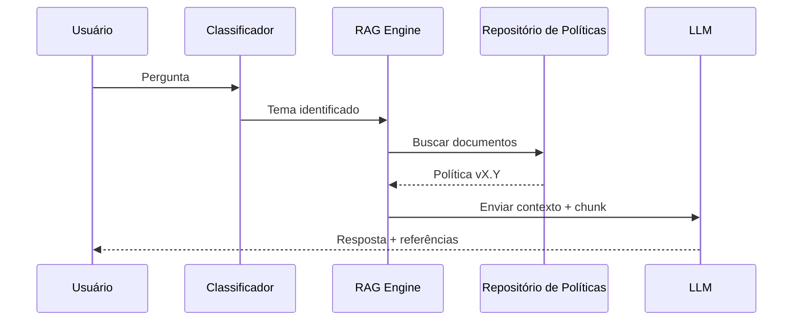

---

# 0.9.9 Rastreabilidade UC → Política → Requisito

| Use Case  | Política                | Requisito Funcional | Requisito NFR |
| --------- | ----------------------- | ------------------- | ------------- |
| UC-RH-01  | Política de Férias v3.1 | RF-01, RF-02        | RNF-PERF-01   |
| UC-SI-04  | Política de E-mail v3.0 | RF-12               | RNF-SEG-02    |
| UC-JUR-01 | Código de Conduta v5.0  | RF-20               | RNF-COMP-01   |

---

# 0.9.10 Conclusão Executiva

A priorização atingiu maturidade completa, permitindo que o projeto avance para:

* arquitetura
* ingestão
* segurança
* testes

O conjunto de Use Cases está aprovado pelos owners e sponsors.

---


---

# 0.10 Backlog Inicial + Kanban

## 🎯 Objetivo

Estabelecer o backlog inicial completo da Fase 0, organizado em épicos, features e user stories, além de fornecer uma visualização em Kanban alinhada ao fluxo de trabalho Scrum/Kanban adotado no projeto.

Esta seção cria a **ponte entre o discovery (Fase 0)** e as fases de **arquitetura, ingestão, agents, DevOps e segurança**, garantindo rastreabilidade total.

---

## 0.10.1 Estrutura do Backlog (Modelo Oficial)

O backlog foi construído segundo os seguintes princípios:

* Cada item deve ser **rastreável** para: política → use case → requisito.
* Todos os itens devem gerar um artefato claro.
* Cada item deve ter **DoR** (Definition of Ready) e **DoD** (Definition of Done).
* Os itens são separados por: **Épicos → Features → User Stories**.

---

# 📦 EPIC 0 — Discovery, Governança & Inventário

Abrange toda a Fase 0.

## FEATURE 0.1 — Governança & Stakeholders

### User Stories

**US-0.1.1 — Mapear stakeholders**

* Como PO, quero identificar todos os stakeholders para garantir alinhamento.
* DoR: lista preliminar; entrevistas agendadas.
* DoD: tabela validada + registrada no artefato 00.

**US-0.1.2 — Criar RACI completo**

* Como responsável de governança, quero um RACI multi-nível para definir responsabilidades.

**US-0.1.3 — Definir papéis do projeto**

* Como PM, quero papéis formalizados para permitir comunicação estruturada.

---

## FEATURE 0.2 — Processos AS-IS

**US-0.2.1 — Mapeamento detalhado AS-IS**
**US-0.2.2 — Entrevistas (RH/Jurídico/SI/Usuários)**
**US-0.2.3 — Identificação de pain points**

---

## FEATURE 0.3 — Inventário de Políticas

**US-0.3.1 — Levantar todos os documentos oficiais**
**US-0.3.2 — Criar catálogo completo de políticas (mega tabela)**
**US-0.3.3 — Criar taxonomia de sensibilidade e acesso**
**US-0.3.4 — Criar fluxo de versionamento e atualização**
**US-0.3.5 — Registrar metadados avançados (hash, vigência, owner)**

---

## FEATURE 0.4 — Use Cases & MVP

**US-0.4.1 — Coletar perguntas reais**
**US-0.4.2 — Normalizar e classificar UCs**
**US-0.4.3 — Criar Decision Tree de priorização**
**US-0.4.4 — Criar Use Case Cards completos**
**US-0.4.5 — Validar MVP com RH/Jurídico/SI**

---

## FEATURE 0.5 — Requisitos

**US-0.5.1 — Requisitos funcionais (RF)**
**US-0.5.2 — Requisitos não funcionais (NFR)**
**US-0.5.3 — Requisitos de segurança e LGPD**
**US-0.5.4 — Requisitos de dados e RAG**
**US-0.5.5 — Requisitos operacionais / suporte**

---

## FEATURE 0.6 — Métricas & QA

**US-0.6.1 — Definir métricas de negócio**
**US-0.6.2 — Definir métricas técnicas (latência, custo)**
**US-0.6.3 — Definir métricas de IA (alucinação, precisão RAG)**
**US-0.6.4 — Criar painel de rastreabilidade**

---

## FEATURE 0.7 — Riscos, Restrições e Premissas

**US-0.7.1 — Criar risk register multi-área**
**US-0.7.2 — Definir premissas**
**US-0.7.3 — Mapear restrições legais, técnicas e operacionais**

---

## FEATURE 0.8 — Gate Final

**US-0.8.1 — Consolidar artefatos 00–10**
**US-0.8.2 — Criar relatório executivo**
**US-0.8.3 — Obter GO/NO-GO**

---

# 0.10.2 Backlog Visual — Kanban da Fase 0

```mermaid
kanban
    section A Fazer
      Mapear stakeholders:1
      Processos AS-IS:2
      Inventário inicial:3
      Coleta de perguntas reais:4
      Levantamento de requisitos:5

    section Em Progresso
      RACI completo:1
      Mega tabela inventário:2
      Use Case Cards:3

    section Revisão
      Matriz RICE e Decision Tree:1
      Requisitos finais:2
      Risk Register:3

    section Concluído
      Modelo de política completa:1
      MVP validado:2
      Gate Fase 0:3
```

---

# 0.10.3 Backlog com Rastreabilidade Completa

Tabela consolidada:

| User Story | Origem     | Conectado a   | Artefato | Dono        |
| ---------- | ---------- | ------------- | -------- | ----------- |
| US-0.2.1   | Processo   | AS-IS         | 01       | PM          |
| US-0.3.2   | Inventário | Políticas     | 02       | RH/Jurídico |
| US-0.4.4   | UCs        | MVP           | 04       | PO          |
| US-0.5.1   | Requisitos | RF            | 05       | Tech Lead   |
| US-0.6.3   | IAOps      | Métricas IA   | 09       | IA Lead     |
| US-0.7.1   | Riscos     | Risk Register | 10       | Segurança   |

---

# 0.10.4 Roadmap Evolutivo (Fase 0 → Fase 1)

```mermaid
flowchart LR
A[Fase 0 — Discovery completo] --> B[Fase 1 — Arquitetura]
B --> C[Fase 2 — Ingestão & Indexação]
C --> D[Fase 3 — Agents Backend]
```

---

# 0.10.5 Definition of Ready (DoR)

Um item só entra na Fase 1 se:

* Escopo claro e aprovado
* Dependências mapeadas
* Responsáveis definidos
* Riscos mitigados

# 0.10.6 Definition of Done (DoD)

* Artefato produzido e anexado
* Revisão jurídica, RH e segurança
* Auditoria interna concluída
* Versão registrada no repositório

---
---

# 0.11 Requisitos (Funcionais, NFRs, Dados, Segurança, Operação)

## 🎯 Objetivo da Seção

Documentar todos os requisitos necessários para que o Assistente de Políticas Internas possa ser projetado, implementado, operado e auditado seguindo padrões corporativos, jurídicos, de segurança e de engenharia de software. Esta é uma seção crítica que prepara a transição para a **Fase 1 – Arquitetura & Design**.

---

# 0.11.1 Estrutura dos Requisitos

Os requisitos estão organizados em cinco grupos:

1. **Requisitos Funcionais (RF)**
2. **Requisitos Não Funcionais (NFR)**
3. **Requisitos de Dados & RAG (RD)**
4. **Requisitos de Segurança & LGPD (RS)**
5. **Requisitos Operacionais (RO)**

Cada requisito deve possuir:

* **ID único**
* **Descrição clara e objetiva**
* **Prioridade** (MUST / SHOULD / NICE)
* **Critérios de Aceitação (CA)**
* **Dependências** (quando aplicável)
* **Origem** (UC, política, stakeholder)

---

# 0.11.2 Requisitos Funcionais (RF)

Requisitos diretamente relacionados ao comportamento esperado do sistema.

## 📘 RF — Catálogo Completo

### **RF-01 — Respostas fundamentadas em políticas oficiais**

* **Descrição:** Todo conteúdo gerado deve se basear exclusivamente em documentos catalogados na Fase 0.3.
* **Prioridade:** MUST
* **CA:** Resposta inclui referência explícita ao documento + seção.

### **RF-02 — Classificação automática do tema da pergunta**

* **Descrição:** O sistema deve detectar automaticamente se a dúvida é RH, Jurídico, Segurança ou Compliance.
* **Prioridade:** MUST

### **RF-03 — Suporte a múltiplos canais**

* **Descrição:** Interface web interna + Teams.
* **Prioridade:** SHOULD

### **RF-04 — Feedback de qualidade (útil / não útil)**

* **Prioridade:** MUST
* **CA:** Deve registrar feedback em logs + telemetria.

### **RF-05 — Histórico de consultas por usuário**

* **Descrição:** Cada usuário pode consultar suas últimas perguntas.
* **Prioridade:** NICE

### **RF-06 — Guardrails contextuais**

* **Descrição:** O sistema deve impedir respostas fora de escopo (dados pessoais, opinião jurídica, diagnóstico trabalhista).
* **Prioridade:** MUST

---

# 0.11.3 Requisitos Não Funcionais (NFR)

Asseguram qualidade, desempenho e manutenção.

## Categorias Utilizadas

* **Desempenho (PERF)**
* **Disponibilidade (AVAIL)**
* **Usabilidade (UX)**
* **Acessibilidade (ACC)**
* **Escalabilidade (SCAL)**
* **Manutenibilidade (MANUT)**
* **Auditabilidade (AUD)**

## 📘 NFR — Catálogo Completo

### **NFR-PERF-01 — Latência média < 4s**

* MUST
* Para 95% das requisições

### **NFR-PERF-02 — P95 < 6s**

* MUST

### **NFR-AVAIL-01 — 99,5% em horário comercial**

* SHOULD

### **NFR-UX-01 — Texto claro e rastreável**

* MUST
* Resposta deve indicar a fonte + seção.

### **NFR-ACC-01 — WCAG 2.1 AA**

* SHOULD

### **NFR-SCAL-01 — Adição de novas políticas sem redeploy**

* MUST

### **NFR-MANUT-01 — Infra como Código (IaC)**

* SHOULD

### **NFR-AUD-01 — Logs imutáveis e criptografados**

* MUST

---

# 0.11.4 Requisitos de Dados & RAG (RD)

Especificações essenciais para ingestão, chunking, indexação e recuperação.

## 📘 RD — Catálogo Completo

### **RD-01 — Apenas documentos do inventário oficial podem ser usados**

* MUST

### **RD-02 — Cada chunk deve conter metadados completos**

* MUST
* Ex.: policy_id, versão, área, sensibilidade

### **RD-03 — Respostas devem referenciar apenas políticas vigentes**

* MUST

### **RD-04 — Indexação deve ser feita em Azure AI Search**

* SHOULD

### **RD-05 — Mecanismos de fallback quando não houver resposta**

* MUST
* Ex.: “Não encontrei essa informação na política vigente.”

### **RD-06 — Histórico de versões deve ser preservado**

* MUST

---

# 0.11.5 Requisitos de Segurança & LGPD (RS)

Essenciais para reduzir risco jurídico e de compliance.

## 📘 RS — Catálogo Completo

### **RS-01 — Autenticação via Entra ID (SSO)**

* MUST

### **RS-02 — Restrições de acesso conforme sensibilidade**

* MUST
* Ex.: Políticas confidenciais → só RH/Jurídico/SI

### **RS-03 — Logs sem dados pessoais sensíveis**

* MUST

### **RS-04 — Encriptação de dados em trânsito e repouso (TLS 1.2+, AES-256)**

* MUST

### **RS-05 — Proteção contra prompt injection e jailbreak**

* MUST
* Implementado via GuardAgent

### **RS-06 — Respostas que revelariam informação confidencial devem ser bloqueadas**

* MUST

### **RS-07 — Conformidade formal com LGPD (artigos relevantes)**

* MUST

---

# 0.11.6 Requisitos Operacionais (RO)

Relacionados ao funcionamento contínuo.

## 📘 RO — Catálogo Completo

### **RO-01 — Alertas automáticos quando taxa de erro > 5%**

* MUST

### **RO-02 — Painel operacional para RH/Jurídico/SI**

* SHOULD
* Métricas: volume, temas, feedback útil, desvios

### **RO-03 — Estratégia de rollback de modelos e prompts**

* MUST

### **RO-04 — Runbooks de incidentes**

* MUST
* Ex.: vazamento, resposta incorreta crítica, queda do sistema

### **RO-05 — Logs devem ser retidos por 12 meses**

* MUST

### **RO-06 — Observabilidade completa via Application Insights**

* SHOULD

---

# 0.11.7 Matriz de Rastreabilidade (UC → RF/NFR → Política)

| Use Case             | Requisitos envolvidos    | Políticas conectadas    |
| -------------------- | ------------------------ | ----------------------- |
| UC-RH-01 Férias      | RF-01, RF-02, RD-01      | Política de Férias v3.1 |
| UC-RH-03 Home Office | RF-01, RD-01, RS-02      | Política de HO v2.0     |
| UC-SEC-01 Email      | RF-01, RS-05, NFR-AUD-01 | Política de Email v3    |
| UC-COMP-01 Conduta   | RF-02, RF-06             | Código de Conduta v5    |

---

# 0.11.8 Critérios de Aceitação Gerais (CA)

Para que o conjunto de requisitos esteja “aceito”:

* Todos os requisitos possuem ID único
* Revisados por RH, Jurídico, SI e TI
* Rastreabilidade completa (UC → Requisito → Política)
* Sem ambiguidade
* Conformidade com LGPD
* Versão registrada no repositório

---


---

# 0.12 Métricas e Indicadores de Sucesso

## 🎯 0.12.1 Objetivo da Seção

Definir **como será medido o sucesso** do Assistente de Políticas Internas e da própria Fase 0, conectando diretamente:

* objetivos de negócio,
* experiência do colaborador,
* riscos jurídicos/compliance,
* operação & tecnologia,
* qualidade da IA/RAG.

Esta seção não descreve a arquitetura, mas **o que será observado** pela gestão, por comitês e por times técnicos para decidir se o projeto está entregando valor.

---

## 0.12.2 Princípios de Medição

1. **Alinhamento ao problema formal (0.1.4)**
   Toda métrica deve responder se estamos, de fato, reduzindo dúvidas, riscos e esforço humano.
2. **Traço de responsabilidade claro**
   Cada métrica tem um *owner* (RH, Jurídico, SI, TI, IA/Analytics).
3. **Fonte de dados definida**
   Tickets, logs do assistente, sistemas de RH, ferramentas de monitoramento, pesquisas internas.
4. **Ciclos de revisão periódicos**
   Métricas são revisadas em cadência (mensal/tirimestral), não apenas ao final do projeto.
5. **Equilíbrio entre volume, qualidade, risco e custo**
   Não adianta só aumentar uso se risco jurídico ou custo explodem.

---

## 0.12.3 Taxonomia de Métricas

As métricas são organizadas em cinco grupos principais:

* **MB — Métricas de Negócio**
  Foco em redução de tickets, tempo e esforço de RH/Jurídico/SI.
* **MX — Métricas de Experiência do Usuário**
  Satisfação do colaborador, adoção, recorrência de uso.
* **MJ — Métricas Jurídico/Compliance**
  Incidentes, aderência a políticas, conformidade com LGPD.
* **MO — Métricas Operacionais & Técnicas**
  Latência, disponibilidade, erros, estabilidade.
* **MI — Métricas de IA & RAG**
  Utilidade percebida, fallback seguro, alucinações, qualidade de recuperação.

Essa taxonomia será refinada nas fases seguintes (Arquitetura, DataOps, IAOps), mas já garante uma visão completa para diretores e donos de processo.

---

## 0.12.4 Quadro Executivo de Métricas-Chave

> **Visão resumida para comitês e diretoria.**

| ID    | Grupo    | Nome Resumido                                           | Tipo      | Exemplo de Meta Indicativa |
| ----- | -------- | ------------------------------------------------------- | --------- | -------------------------- |
| MB-01 | Negócio  | Redução de tickets RH/Jurídico                          | Resultado | ≥ 50–60% em 6–12 meses     |
| MB-02 | Negócio  | Redução do tempo médio de resposta ao colaborador       | Resultado | ≥ 70–80% vs. baseline      |
| MX-01 | UX       | Satisfação com respostas (CSAT do bot)                  | Percepção | Nota ≥ 4,3 / 5             |
| MJ-01 | Jurídico | Incidentes causados por resposta incorreta              | Risco     | 0 incidentes críticos      |
| MO-01 | Técnico  | Latência P95 das respostas                              | Técnica   | < 4s (MVP: < 6s)           |
| MO-02 | Técnico  | Disponibilidade em horário comercial                    | Técnica   | ≥ 99,5%                    |
| MI-01 | IA/RAG   | Taxa de respostas "úteis" (👍)                          | Qualidade | ≥ 85–90%                   |
| MI-02 | IA/RAG   | Taxa de fallback seguro ("não encontrei com segurança") | Qualidade | 5–15%                      |

> Os valores finais serão ajustados na Fase 1–2, após análise de baseline e capacidade técnica.

---

## 0.12.5 Descrição Resumida por Grupo de Métricas

### 0.12.5.1 Métricas de Negócio (MB)

* Volume de tickets sobre políticas por mês (antes x depois).
* Tempo médio de atendimento de dúvidas quando não há assistente x com assistente.
* Horas de trabalho poupadas de RH/Jurídico/SI (estimativa com base em tempos médios atuais).

### 0.12.5.2 Métricas de Experiência do Usuário (MX)

* CSAT por resposta (escala 1–5).
* NPS interno do canal de políticas.
* Taxa de uso recorrente (usuários que voltam ao menos 1x/mês).

### 0.12.5.3 Métricas Jurídico/Compliance (MJ)

* Incidentes relacionados a respostas equivocadas;
* Aderência das respostas às políticas vigentes, medida por amostragem trimestral;
* Indicadores específicos de LGPD (ex.: casos de exposição indevida de dados em respostas).

### 0.12.5.4 Métricas Operacionais & Técnicas (MO)

* Latência média e P95 em produção;
* Disponibilidade do serviço;
* Taxa de erros técnicos (5xx, timeouts, falhas de integração).

### 0.12.5.5 Métricas de IA & RAG (MI)

* Taxa de respostas marcadas como úteis (👍/👎);
* Taxa de fallback seguro (quando o sistema assume não ter base confiável para responder);
* Taxa de alucinação detectada em auditorias periódicas;
* Qualidade da recuperação (documentos corretos sendo trazidos para cada pergunta, via avaliação amostral).

---

## 0.12.6 Pipeline de Medição e Governança

```mermaid
graph LR
  A[Interações dos usuários] --> B[Logs estruturados do Assistente]
  B --> C[Camada de Dados / Data Lake]
  C --> D[Modelos de Métricas (SQL/ETL/BI)]
  D --> E[Dashboards (Negócio, Técnico, Jurídico)]
  E --> F[Comitês de Revisão]
  F --> G[Ajustes em políticas, prompts, modelos e operações]
```

* **Logs estruturados** são desenhados desde a Fase 1 (arquitetura) para suportar as métricas de 0.12.
* **Dashboards** serão construídos em Fases futuras (DataOps/IAOps), mas já com esta estrutura-alvo em mente.

---

## 0.12.7 Governança das Métricas

* **Revisão mensal**: foco em uso, performance e satisfação (RH + TI + IA/Analytics).
* **Revisão trimestral ampliada**: inclusão de Jurídico, Segurança e Compliance para análise de risco e incidentes.
* **Ações típicas** decorrentes da análise:

  * ajuste de prompts, políticas de chunking e thresholds de confiança;
  * inclusão/remoção de documentos no inventário (0.7);
  * revisão de escopo de use cases (0.9) com base em nova demanda.

---


---

# 0.13 Riscos, Premissas e Restrições

## 🎯 0.13.1 Objetivo da Seção

Documentar e analisar todos os elementos que podem **limitar**, **condicionar** ou **comprometer** o sucesso do Assistente de Políticas Internas. Inclui uma avaliação sistemática dos principais riscos, pressupostos adotados e restrições impostas por tecnologia, negócio, compliance, segurança e stakeholders.

Esta seção complementa as métricas (0.12) e antecipa o modelo de governança contínua (Capítulo 2 — Arquitetura), permitindo decisões conscientes antes do início do desenvolvimento.

---

## 🧩 0.13.2 Estrutura Geral

A seção é dividida em três grupos:

1. **Riscos** — eventos potencialmente negativos.
2. **Premissas** — hipóteses consideradas verdadeiras até prova em contrário.
3. **Restrições** — limites fixos, não negociáveis.

Cada grupo possui quadros executivos e tabelas detalhadas.

---

## ⚠️ 0.13.3 Registro de Riscos (Risk Register)

### 0.13.3.1 Riscos Prioritários (Visão Executiva)

| ID | Categoria  | Descrição                                            | Prob. | Impacto | Nível   | Estratégia                                               | Dono           |
| -- | ---------- | ---------------------------------------------------- | ----- | ------- | ------- | -------------------------------------------------------- | -------------- |
| R1 | Negócio    | Políticas desatualizadas causam respostas incorretas | Média | Alta    | Alto    | Processo formal de versionamento + notificações a owners | RH             |
| R2 | Legal      | Resposta incorreta gera risco trabalhista            | Baixa | Alta    | Alto    | Guardrails + validação de respostas críticas             | Jurídico       |
| R3 | Financeiro | Custo de tokens maior que o previsto                 | Média | Média   | Médio   | Caching + compressão + benchmarks de custo               | TI/FinOps      |
| R4 | Segurança  | Jailbreak/prompt injection                           | Alta  | Alta    | Crítico | Hardening + filtros + testes ofensivos                   | Segurança      |
| R5 | Adoção     | Baixa aderência ao novo canal                        | Média | Média   | Médio   | Campanha interna + onboarding                            | RH/Comunicação |

### 0.13.3.2 Tabela Completa de Riscos

(Com colunas adicionais exigidas em governança corporativa)

| ID | Risco                       | Tipo      | Probabilidade | Impacto | Severidade | Sinais Antecipatórios    | Mitigação              | Plano de Contingência             | Dono  | Prazo    |
| -- | --------------------------- | --------- | ------------- | ------- | ---------- | ------------------------ | ---------------------- | --------------------------------- | ----- | -------- |
| R1 | Documentação defasada       | Negócio   | M             | A       | Alto       | Perguntas em conflito    | Repositório controlado | Suspender respostas desse domínio | RH    | Contínuo |
| R2 | Bot responde fora do escopo | IA        | M             | A       | Alto       | Latência de confusão     | Tune fino + restrições | Fallback 100% seguro              | IA/SI | Fase 2   |
| R3 | Aumento de custos           | FinOps    | M             | M       | Médio      | Crescimento não previsto | Alertas de custo       | Ajuste de modelos e compressão    | TI    | Contínuo |
| R4 | Ataque de segurança         | Segurança | A             | A       | Crítico    | Logs anômalos            | Hardening              | Desativação + rollback            | SI    | Imediato |
| R5 | Não aderência do time       | Humano    | M             | M       | Médio      | Pouco uso                | Campanha + treinamento | Incentivos internos               | RH    | MVP      |

---

## 🔍 0.13.4 Premissas do Projeto

### 0.13.4.1 Quadro Executivos de Premissas

| ID | Premissa                                                      | Categoria  | Validação               | Dono |
| -- | ------------------------------------------------------------- | ---------- | ----------------------- | ---- |
| P1 | Todas as políticas oficiais serão entregues até a Fase 2      | Negócio    | Validar com RH/Jurídico | RH   |
| P2 | Haverá disponibilidade das áreas para participar das revisões | Governança | Calendário validado     | PMO  |
| P3 | O acesso SSO estará disponível e funcional                    | TI         | Validar com Infra       | TI   |
| P4 | Não há políticas tácitas críticas não formalizadas            | RH         | Auditoria inicial       | RH   |
| P5 | O ambiente Azure é o único permitido para dados               | Segurança  | Política interna        | SI   |

### 0.13.4.2 Premissas Detalhadas

1. **Tecnológicas**

   * Azure será o ambiente oficial.
   * O pipeline de ingestão de documentos será padronizado.
   * Azure Entra ID será integrado antes do MVP.

2. **Organizacionais**

   * RH, Jurídico e SI participarão de revisões quinzenais.
   * Os owners de políticas responderão a requisições em até 5 dias úteis.

3. **De Dados**

   * Todo documento utilizado terá um owner formal.
   * Não haverá uso de documentos sem versão e sem aprovação.

---

## 🧱 0.13.5 Restrições do Projeto

### 0.13.5.1 Restrições Fixas

| ID | Restrição   | Tipo                                             | Descrição                                          |
| -- | ----------- | ------------------------------------------------ | -------------------------------------------------- |
| C1 | Ambiente    | Dados não podem sair do Azure                    | Ambiente deve ser 100% Azure, incluindo RAG e logs |
| C2 | Jurídica    | Respostas não podem gerar interpretação jurídica | O agente não substitui parecer jurídico            |
| C3 | Segurança   | Política de SI define acesso mínimo              | Não é permitido acesso sem SSO                     |
| C4 | Temporal    | MVP deve entrar em produção até a data X         | Marco obrigatório definido pelo sponsor            |
| C5 | Operacional | RH é dono do conteúdo                            | Nenhuma alteração ocorre sem aprovação formal      |

### 0.13.5.2 Restrições Técnicas

* Modelos devem ser compatíveis com políticas internas de segurança.
* Logs devem ser anonimizados sempre que possível.
* Não é permitido o uso de serviços que armazenem dados fora do país (dependendo da LGPD).

---

## 🧭 0.13.6 Matriz Integrada (Riscos × Premissas × Restrições)

```mermaid
flowchart TD
    A[Riscos] -->|influenciam| B[Plano de Mitigação]
    C[Premissas] -->|se violadas geram| A
    D[Restrições] -->|limitam| E[Arquitetura Técnica]
    B --> F[Ação]
    E --> F
```

---
---

# 0.14 Gate de Aprovação

## 🎯 Objetivo da Seção

Formalizar o momento decisório que determina se o projeto pode avançar da **Fase 0 (Descoberta, Escopo e Requisitos)** para a **Fase 1 (Arquitetura de Referência e Design Técnico)**.

O Gate de Aprovação funciona como uma **auditoria executiva e técnica**, garantindo que:

* nada crítico ficou pendente,
* não há riscos inaceitáveis,
* todos os stakeholders essenciais validaram suas partes,
* os artefatos estão completos, coerentes e versionáveis.

---

## ✔️ 0.14.1 Critérios Obrigatórios (GO-NoGO)

Para avançar, **todos** os critérios abaixo devem estar marcados como ATENDIDOS.

### 1. Escopo e Use Cases

*

### 2. Requisitos

*

### 3. Artefatos Formais

*

### 4. Aprovações

*

---

## 🟦 0.14.2 Mapa Visual do Gate

```mermaid
flowchart LR
    A[Conclusão da Fase 0] --> B[Revisão Técnica]
    B --> C[Revisão de Segurança]
    C --> D[Revisão de Negócio]
    D --> E[Sponsor]
    E -->|GO| F[Início da Fase 1]
    E -->|NO-GO| G[Correções na Fase 0]
```

---

## 🔍 0.14.3 Critérios de Qualidade (What “Good” Looks Like)

Para este Gate, boa qualidade significa:

### **Clareza**

Todos os documentos estão legíveis, rastreáveis e seguem o estilo do livro.

### **Completude**

Nenhuma área crítica (RH, Jurídico, Segurança, TI) tem lacunas.

### **Coerência**

Requisitos, riscos, métricas e escopo não se contradizem.

### **Viabilidade**

Não há requisitos impossíveis ou restrições inviáveis.

### **Governança ativa**

Existem donos claros para tudo que será validado.

---

## 🟥 0.14.4 Critérios de Bloqueio (NO-GO)

O projeto **não avança** se um ou mais itens ocorrerem:

* ❌ Políticas críticas desatualizadas (férias, conduta, segurança)
* ❌ Falta de owner formal da política (RH/Jurídico)
* ❌ Falta de validação de Segurança da Informação
* ❌ Métricas incompletas ou sem fonte de dados definida
* ❌ Escopo do MVP indefinido ou contestado por stakeholders
* ❌ Riscos críticos sem mitigação plausível
* ❌ Divergência entre Política Oficial e inventário (0.3)

---

## 📝 0.14.5 Template Oficial do GO/NoGO

```md
# Documento de Gate – Fase 0 -> Fase 1

**Data:** ___/___/____
**Responsável pela compilação:** ______________________

## 1. Decisão
- ( ) GO – Aprovado para a Fase 1
- ( ) NO-GO – Correções necessárias

## 2. Justificativas
> Descrever razões da aprovação ou motivos de bloqueio.

## 3. Itens Pendentes
- [ ] Item 1
- [ ] Item 2
- [ ] Item 3

## 4. Assinaturas
- Product Owner: ____________________
- RH: ____________________
- Jurídico: ____________________
- Segurança da Informação: ____________________
- TI: ____________________
- Sponsor Executivo: ____________________
```
---
---

# 0.15 Apêndice da Fase 0 — Glossários, Referências e FAQ

## 🎯 Objetivo da Seção

Este apêndice consolida **todo o material de apoio** necessário para interpretação completa da Fase 0, servindo como:

* referência rápida,
* suporte conceitual,
* guia terminológico,
* material de consulta para equipes técnicas, jurídicas, RH e segurança.

Inclui glossários, modelos, padrões utilizados, links internos e externos, e uma FAQ para eliminar ambiguidades.

---

# 📘 0.15.1 Glossário Técnico

| Termo                                    | Definição                                                                                   |
| ---------------------------------------- | ------------------------------------------------------------------------------------------- |
| **RAG (Retrieval-Augmented Generation)** | Técnica de IA que combina busca de documentos com geração de linguagem natural.             |
| **Chunk**                                | Fragmento de texto derivado de documentos oficiais, usado na base vetorial.                 |
| **Embedding**                            | Representação numérica de um texto para permitir busca semântica.                           |
| **Vector Store**                         | Banco de dados especializado em armazenar e buscar embeddings.                              |
| **SSO (Single Sign-On)**                 | Autenticação única corporativa utilizada para acesso seguro ao agente.                      |
| **Guardrails / GuardAgent**              | Camadas de segurança que filtram, corrigem e bloqueiam respostas inadequadas ou arriscadas. |
| **FinOps**                               | Práticas para otimização de custos em serviços de nuvem e IA.                               |
| **BPMN**                                 | Notação padrão para modelagem de processos de negócios.                                     |

---

# ⚖️ 0.15.2 Glossário Jurídico / Compliance

| Termo                    | Definição                                                                              |
| ------------------------ | -------------------------------------------------------------------------------------- |
| **LGPD**                 | Lei Geral de Proteção de Dados (lei brasileira que rege tratamento de dados pessoais). |
| **DPO / Encarregado**    | Profissional responsável pela governança de dados e pela LGPD na organização.          |
| **Política Corporativa** | Documento formal contendo regras e diretrizes internas.                                |
| **Confidencialidade**    | Nível mais restrito de acesso a documentos internos.                                   |
| **Base legal**           | Justificativa jurídica para tratamento de dados.                                       |

---

# 🧱 0.15.3 Padrões Utilizados na Fase 0

### 🔹 Padrões de documentação

* Markdown estruturado (livro técnico)
* Quadros executivos
* Tabelas corporativas
* Mermaid para diagramas
* Templates formais para requisitos, riscos, métricas

### 🔹 Padrões de arquitetura

* RAG corporativo
* Vector Store centralizado
* SSO / Entra ID
* Pipelines auditáveis

### 🔹 Padrões de governança

* RACI completo
* Registro de riscos
* Gate de aprovação GO/NO-GO
* Owners formais para políticas

---

# 📚 0.15.4 Referências Internas do Livro

| Seção    | Descrição                 |
| -------- | ------------------------- |
| **0.1**  | Stakeholders & Governança |
| **0.2**  | Processos AS-IS           |
| **0.3**  | Inventário de Políticas   |
| **0.4**  | Use Cases & MVP           |
| **0.5**  | Requisitos                |
| **0.6**  | Métricas                  |
| **0.7**  | Riscos, Premissas         |
| **0.8**  | Gate                      |
| **0.10** | Backlog                   |
| **0.11** | Requisitos Expandidos     |

(Links serão adicionados após a consolidação do livro.)

---

# 🌐 0.15.5 Referências Externas

* **NIST AI Framework** – [https://www.nist.gov/itl/ai-risk-management-framework](https://www.nist.gov/itl/ai-risk-management-framework)
* **Microsoft Responsible AI Standard** – [https://learn.microsoft.com](https://learn.microsoft.com)
* **Google Cloud – Generative AI Enterprise Guide**
* **Azure Well-Architected Framework**
* **OWASP LLM Top 10** – segurança para modelos generativos
* **LGPD (Lei 13.709)** – legislação completa

---

# ❓ 0.15.6 FAQ da Fase 0

### **1. Onde ficam armazenadas as políticas oficiais?**

No repositório corporativo definido no inventário (SharePoint / File Server / Azure Blob).

### **2. O agente pode responder perguntas de cunho jurídico?**

Não. Ele só referencia políticas internas e trechos documentais. Parecer jurídico formal é responsabilidade do Jurídico.

### **3. Como funciona a atualização de políticas no agente?**

A política é atualizada no repositório → pipeline detecta a mudança → reprocessa embeddings → versão antiga é arquivada.

### **4. Quem aprova a resposta do bot?**

RH/Jurídico/SI validam antes do piloto; depois o processo passa a ser contínuo via governança.

### **5. O bot pode acessar dados pessoais dos funcionários?**

Não. Ele só responde sobre **políticas**, não sobre **informações individuais**.

### **6. É obrigatório estar no Azure?**

Sim, por restrição definida em 0.13.

---

# 🔗 Encerramento da Fase 0

A Fase 0 está **formalmente concluída** com este apêndice.

➡ Próximo capítulo: **Fase 1 — Arquitetura de Referência e Design Técnico**
