# Fase 1 — Arquitetura & Design

---

## 🧭 Breadcrumb

Home → Livro Técnico → **Fase 1 — Arquitetura & Design**

---

## 📌 Índice

>
> * [1. Contexto e Objetivos da Fase 1](#1-contexto-e-objetivos-da-fase-1)
> * [2. Arquitetura Conceitual](#2-arquitetura-conceitual-visão-de-domínio)
> * [3. Arquitetura Lógica](#3-arquitetura-lógica)
> * [4. Arquitetura Física em Azure](#4-arquitetura-física-em-azure)
> * [5. Arquitetura de Agentes](#5-arquitetura-de-agentes)
> * [6. Arquitetura de RAG](#6-arquitetura-de-rag)
> * [7. Context Engineering & Prompt Engineering](#7-context-engineering--prompt-engineering)
> * [8. Design de APIs e protocolos](#8-design-de-apis)
> * [9. Design de caching](#9-design-de-caching)
> * [10. Arquitetura de Segurança](#10-arquitetura-de-segurança)
> * [11. Observabilidade & IA Evaluation](#11-observabilidade--ia-evaluation)
> * [12. Arquitetura de Custo & Performance](#12-arquitetura-de-custo--performance)
> * [13. Artefatos da Fase 1 & Gate de Saída](#13-artefatos-da-fase-1--gate-de-saída)

---

# 1. Contexto e Objetivos da Fase 1

A Fase 1 transforma tudo o que foi levantado e validado na Fase 0 em uma **arquitetura completa**, documentada e rastreável. Aqui definimos *como* o sistema funciona, *onde roda*, *como os agentes conversam* e *quais padrões de IA serão aplicados*.

Ao final da fase, qualquer engenheiro deve ser capaz de:

* Implementar o backend dos agentes com base no design.
* Configurar pipelines de DataOps para políticas.
* Conectar canais (Teams, web) a APIs bem definidas.
* Garantir performance, segurança, custo e observabilidade.

### 🎯 Objetivo Central

Criar a **arquitetura oficial** do Assistente de Políticas Internas, composta por cinco eixos:

1. **Domínio (conceitual)**
2. **Componentes (lógica)**
3. **Infraestrutura e redes (física)**
4. **IA e agentes (patterns e interações)**
5. **Governança técnica (segurança, custo, observabilidade)**

---

# 2. Arquitetura Conceitual (Visão de Domínio)

## 2.1 Entidades Principais

As entidades representam tudo o que existe na solução:

* **User** – quem usa o sistema.
* **UserContext** – unidade/área, idioma, clearance, histórico relevante.
* **Question** – pergunta enviada.
* **Answer** – resposta final entregue.
* **PolicyDocument** – política oficial.
* **PolicyVersion** – versão histórica.
* **PolicyChunk** – trecho dentro da política.
* **Interaction** – ciclo pergunta–resposta.
* **EvalSample** – exemplo usado para avaliação.
* **AgentRun** – execução de um agente.
* **ToolCall** – chamada de ferramenta.

## 2.2 Modelo Conceitual — Texto

1. Um **User** envia uma **Question**.
2. O sistema cria um **UserContext**.
3. Uma **Interaction** é aberta e passa pelos agentes:

   * OrchestratorAgent → decide o fluxo.
   * PolicyRAGAgent → busca respostas com base em políticas.
   * GuardAgent → valida segurança e compliance.
4. O PolicyRAGAgent usa **PolicyChunks** como contexto.
5. A resposta final é um **Answer**, registrado com fontes e métricas.
6. Avaliações registram **EvalSample** e **AgentRun**.

## 2.3 Diagrama Conceitual

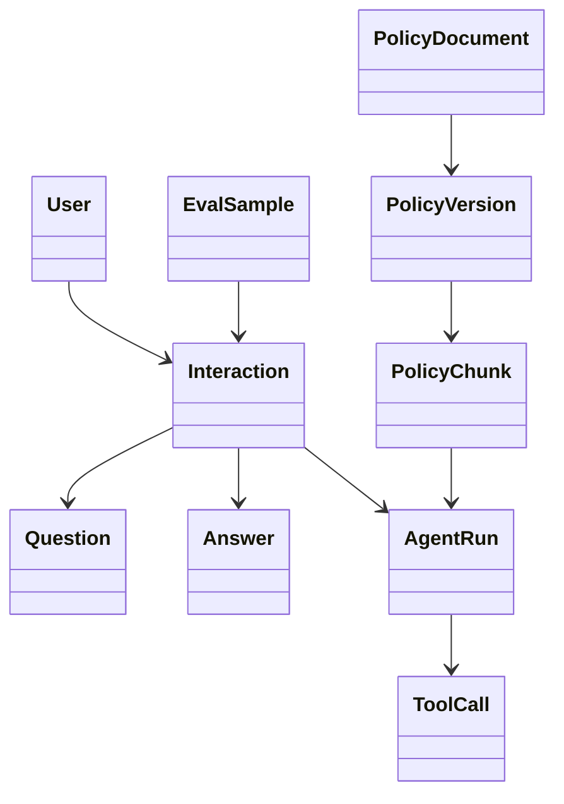

---

# 3. Arquitetura Lógica

## 3.1 Camadas Principais

### **1. Channels Layer (Camada de Canais)**

* Web Portal (React)
* Teams Bot
* Futuro: WhatsApp corporativo, Portal RH

### **2. API & Gateway Layer**

* Azure API Management
* Autenticação e autorização via JWT/EntraID
* Endpoints REST

### **3. Application & Agents Layer**

* Backend (FastAPI/Node/Nest)
* OrchestratorAgent, PolicyRAGAgent, GuardAgent
* Services: SearchService, PolicyContext, Logging, Cost

### **4. AI & Tools Layer**

* Azure OpenAI (LLMs e embeddings)
* search_policies_tool, log_interaction_tool

### **5. Data & Index Layer**

* Storage (raw/processed)
* Azure Cognitive Search (índice vetorial)
* PostgreSQL/SQL opcional

### **6. Observability & Governance Layer**

* App Insights, Monitor, Log Analytics

## 3.2 Diagrama de Arquitetura Lógica (Mermaid)

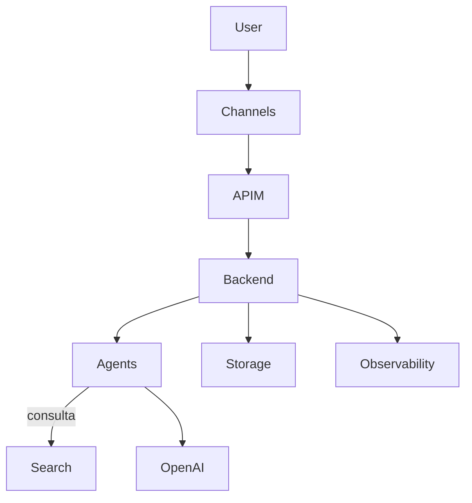

---

# 4. Arquitetura Física em Azure

## 4.1 Resource Groups

* **rg-policy-assistant-core** – backend, APIM, Redis
* **rg-policy-assistant-data** – Storage, Search
* **rg-policy-assistant-ai** – OpenAI
* **rg-policy-assistant-observability** – AppInsights, LogAnalytics
* **rg-policy-assistant-network** – VNet + Subnets

## 4.2 Topologia de Rede

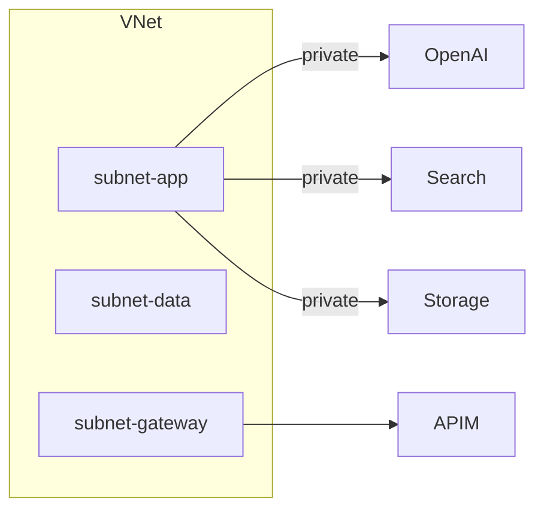

## 4.3 Segurança de Infra

* NSGs entre subnets
* Key Vault para segredos
* RBAC com Managed Identities

---

# 5. Arquitetura de Agentes

## 5.1 Agentes Principais

### **OrchestratorAgent**

Decide fluxo → policy query? small talk? out of scope?

### **PolicyRAGAgent**

Executa busca, monta prompt, produz resposta fundamentada.

### **GuardAgent**

Valida segurança, sanitiza ou bloqueia.

## 5.2 Agentes auxiliares

* IntentClassifierAgent
* EvalAgent (avalia IA)

## 5.3 Fluxo multi-agente (Mermaid)

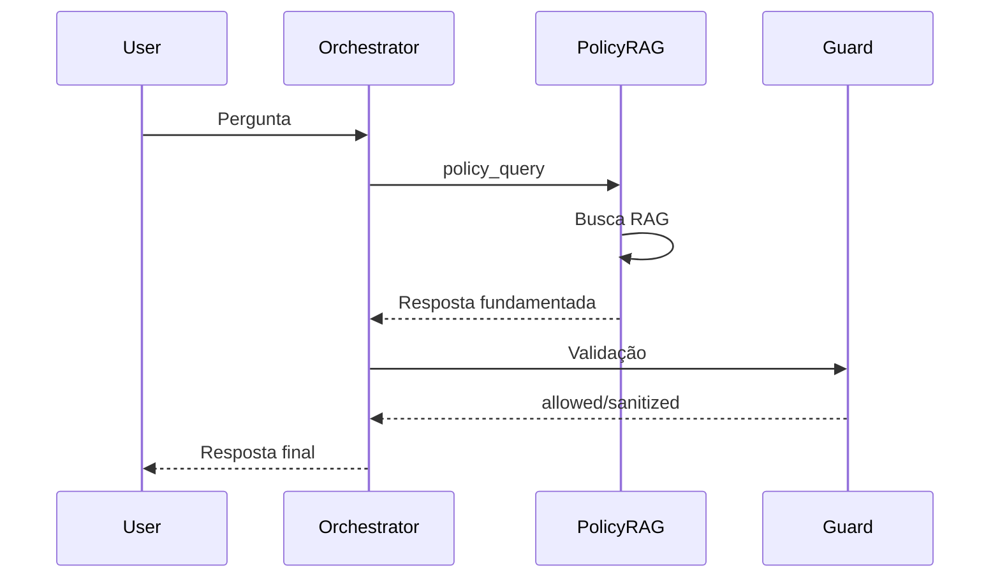

---

# 6. Arquitetura de RAG

## 6.1 Estrutura do Índice

Campos obrigatórios: id, policy_id, version, section, content, embedding, sensibilidade.

## 6.2 Estratégia de Chunking

* 300–500 tokens
* Quebra por heading semântico
* Sempre metadado completo

## 6.3 Fluxo de Consulta RAG

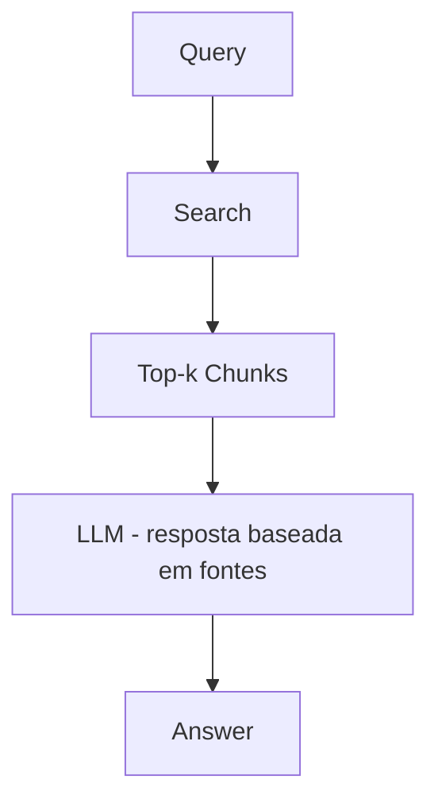

## 6.4 Fallback

Se nenhum chunk relevante → resposta “sem política oficial”.

---

# 7. Context Engineering & Prompt Engineering

## 7.1 System Prompts por Agente

* Orchestrator: intenção + regras.
* PolicyRAG: usar somente chunks fornecidos.
* Guard: auditor de segurança.

## 7.2 Patterns

* Few-shot
* Style Guide corporativo
* Constraints de segurança

## 7.3 Versionamento

Prompts versionados como código: `policy_rag_v1.0.0`.

---

# 8. Design de APIs

## 8.1 Endpoints

### `POST /api/chat`

Retorna resposta + fontes + métricas.

### `POST /api/feedback`

Armazena nota humana.

### `GET /api/health`

Verificações básicas.

## 8.2 Protocolos Internos

* HTTP → OpenAI
* HTTP → Search
* Redis → cache

---

# 9. Design de Caching

## 9.1 O que cachear

* Embeddings
* Top-k de consultas RAG
* FAQ
* Contexto de sessão

## 9.2 Onde

* Redis
* In-memory

## 9.3 Invalidation

Sempre que política mudar, o pipeline dispara eventos que limpam caches relacionados.

---

# 10. Arquitetura de Segurança

## 10.1 Modelo de Identidade & Acesso

* Autenticação via Azure Entra ID (SSO corporativo).
* Autorização via JWT com claims: `role`, `department`, `clearance`.
* Backend usa Managed Identity para acessar Search, Storage e Key Vault.

## 10.2 Modelo STRIDE de ameaças

| Ameaça                         | Descrição                      | Controles                                           |
| ------------------------------ | ------------------------------ | --------------------------------------------------- |
| **S – Spoofing**               | Usuário fingir identidade      | EntraID + JWT assinado + verificação de sessão      |
| **T – Tampering**              | Alteração de políticas ou logs | RBAC + Storage imutável + assinatura                |
| **R – Repudiation**            | "Eu não enviei isso"           | Interaction logs com timestamp + ID                 |
| **I – Information Disclosure** | Vazamento de política restrita | GuardAgent + Content Safety + filtros por clearance |
| **D – Denial of Service**      | Sobrecarga intencional         | Rate limiting + quotas no APIM                      |
| **E – Elevation of Privilege** | Acesso indevido                | RBAC granular + filtragem no RAG                    |

## 10.3 Fluxo de Segurança (Mermaid)

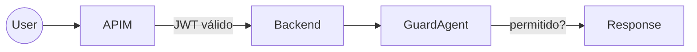

## 10.4 Controles Obrigatórios

* TLS 1.2+ em todo tráfego.
* Segredos *somente* no Key Vault.
* Content Safety ativo no GuardAgent.
* Tentativas de jailbreak logadas em canal dedicado.

---

# 11. Observabilidade & IA Evaluation

## 11.1 Logging Estruturado

Cada `/chat` gera registro:

* interaction_id, user_id, timestamp
* model_name, tokens_in/out
* agentes chamados
* políticas usadas
* decisão do GuardAgent

## 11.2 Metrics (Prometheus/Azure Monitor)

* `latency_ms_p50/p90/p95`
* `rag_hit_ratio`
* `blocked_responses_total`
* `attempted_jailbreaks`
* `llm_cost_usd`

## 11.3 Distributed Tracing (OpenTelemetry)

### Spans principais:

* `chat_request`
* `orchestrator_decision`
* `rag_search`
* `llm_answer_generation`
* `guard_validation`

## 11.4 Arquitetura de Observabilidade (Mermaid)

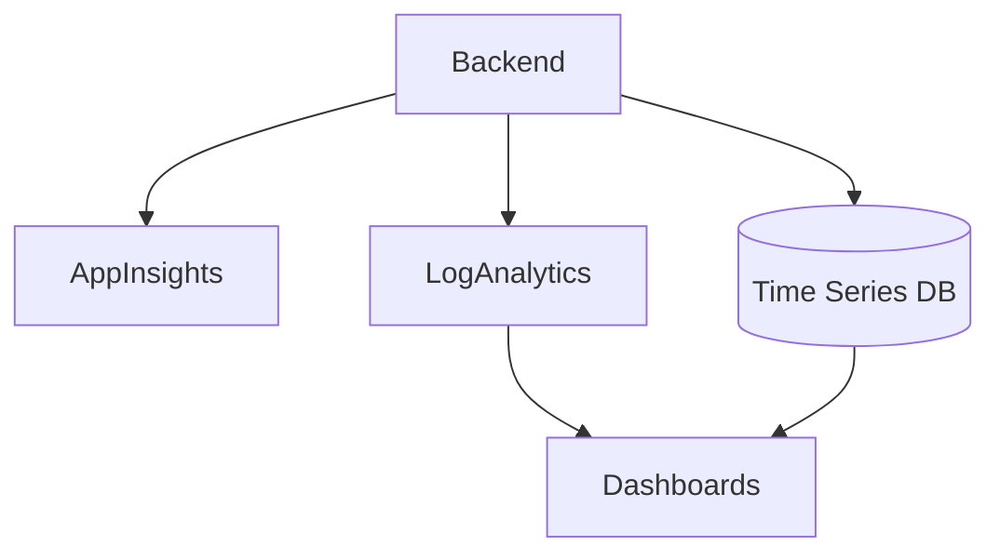

## 11.5 IA Evaluation Pipeline

* Execução automática diária de evals.
* Métricas: precisão semântica, aderência à política, completude.
* Avaliação híbrida: humana + LLM-as-a-judge.

---

# 12. Arquitetura de Custo & Performance

## 12.1 Estimativa de Carga Inicial

* 1000 usuários ativos/dia.
* ~2000 interações/dia.
* Pico: ~300 req/h.

## 12.2 Dimensionamento Inicial

### Backend

* 2–4 instâncias (Container Apps) vCPU 2–4.

### Search

* SKU S1 ou S2 conforme volume.

### Redis

* 1–2 GB para caching de embeddings e queries.

### Azure OpenAI

* Modelo principal: GPT-4.x
* Modelo auxiliar: GPT-4-mini ou 4-small para classificações.

## 12.3 Estratégias de Otimização

* Redução de tokens via prompts enxutos.
* RAG eficiente com chunks curtos.
* Cache agressivo para queries repetidas.
* Evitar chamadas longas com histórico excessivo.

## 12.4 Modelo de Custos (Tabela)

| Componente      | Estimativa Mensal | Notas                 |
| --------------- | ----------------- | --------------------- |
| Azure OpenAI    | US$ 500–1500      | Depende de tokens/mês |
| Azure Search    | US$ 100–300       | Conforme SKU          |
| Container Apps  | US$ 80–250        | Escala horizontal     |
| Redis           | US$ 50–120        | Volume+throughput     |
| Observabilidade | US$ 40–100        | Logs e métricas       |

## 12.5 Alertas e Automação

* Alerta: custo > 70% do orçamento.
* Corte automático: reduzir chamadas a modelos caros.
* Migração dinâmica para modelo menor em horários de pico.
---
---

# 13. Artefatos da Fase 1 & Gate de Saída

### 📁 13.1 Artefatos esperados

* Arquitetura geral (overview, lógica, física)
* Design de agentes
* Arquitetura de RAG
* APIs e contratos
* Segurança
* Observabilidade
* Custo & performance
* ADRs

### 🧪 13.2 QA (Go/No-Go)

* Arquitetura completa e coerente
* RAG validado
* Segurança assinada pelo CISO/DPO
* APIs estáveis
* Custos estimados
* Prompts versionados

### 🧩 13.3 Diagrama de Gate

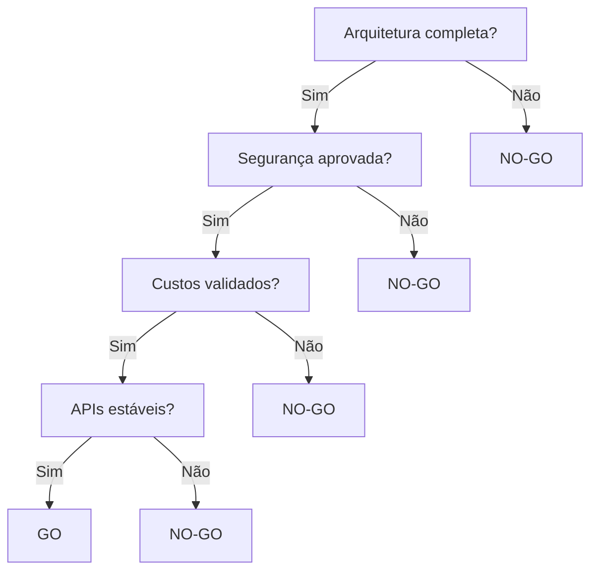

## 13.4 Diagramas C4 da Fase 1

## 🏛️ C4 — Nível 1: Diagrama de Contexto

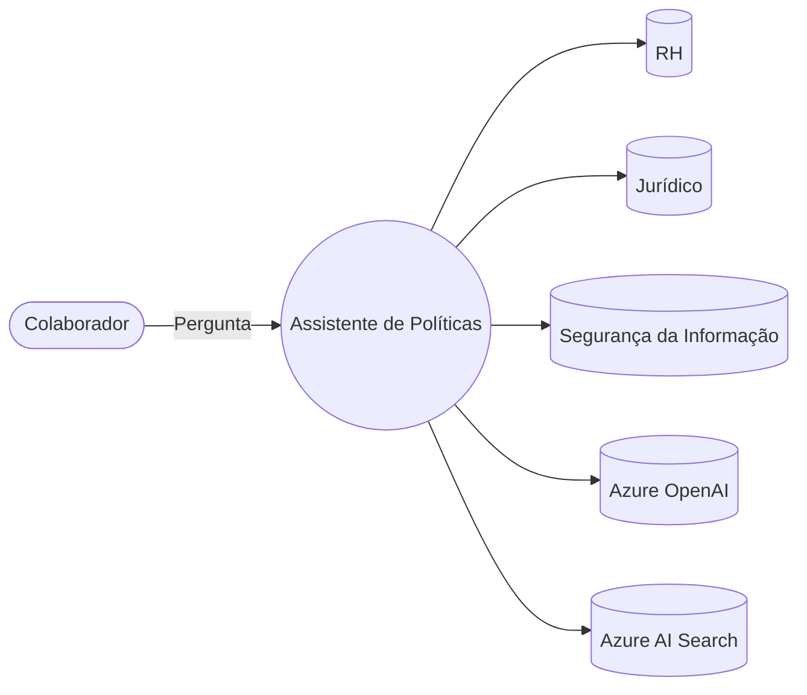

## 🏗️ C4 — Nível 2: Diagrama de Containers

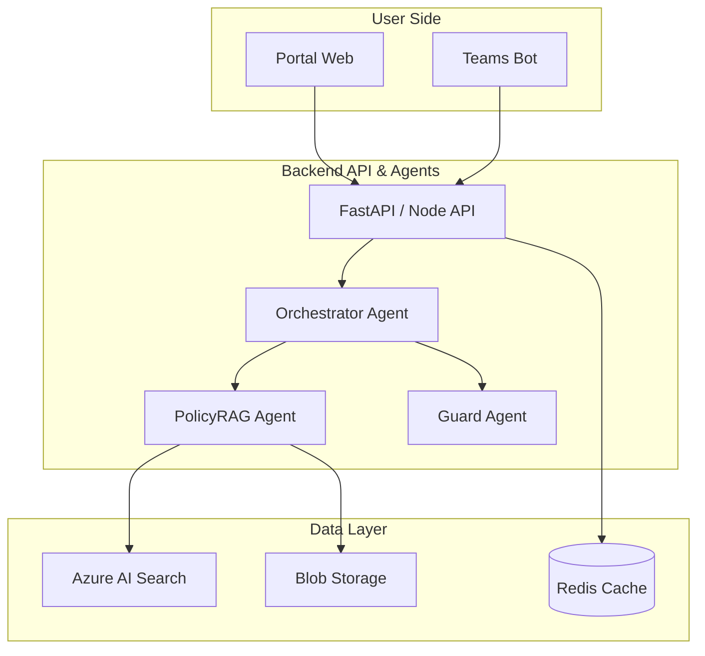

## 🧩 C4 — Nível 3: Diagrama de Componentes do Backend

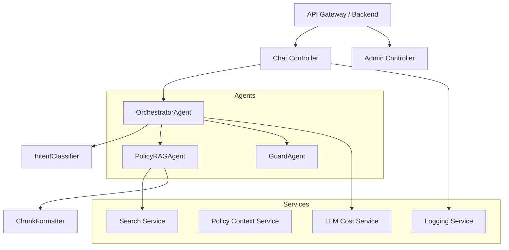

---

## 13.5 Quadros Expandidos (Riscos, Métricas, Segurança)

## 📊 1. Quadro de Riscos Técnicos da Arquitetura

| ID | Risco                            | Tipo        | Prob. | Impacto | Severidade | Mitigação                               |
| -- | -------------------------------- | ----------- | ----- | ------- | ---------- | --------------------------------------- |
| A1 | Latência alta do RAG             | Performance | M     | A       | Alta       | Cache, otimização de chunking           |
| A2 | Erro em políticas desatualizadas | Dados       | A     | A       | Alta       | Pipeline de versionamento               |
| A3 | Vazamento de dados               | Segurança   | B     | A       | Alta       | GuardAgent + filtragem de sensibilidade |
| A4 | Custo acima do previsto          | FinOps      | M     | M       | Média      | Alerts + fallback model                 |

## 📏 2. Quadro de Métricas Go/No-Go

| Categoria | Métrica               | Meta                | Observações               |
| --------- | --------------------- | ------------------- | ------------------------- |
| Negócio   | Redução de tickets    | ≥ 30%               | Medido 60 dias pós deploy |
| Técnico   | Latência P95          | < 4s                | Inclui RAG                |
| IA        | Aderência à política  | ≥ 92%               | Avaliação humana+LLM      |
| Segurança | Tentativas bloqueadas | ≥ 98%               | GuardAgent                |
| Custos    | Tokens/mês            | dentro do orçamento | via CostService           |

---

## 13.6 Workflow de Validação Final (Gate de Saída)

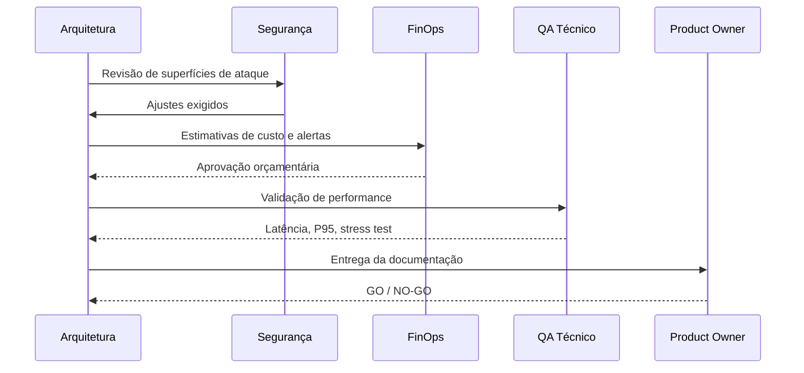

---

## 13.7 Super-Checklist Completo da Fase 1

* [ ] Arquitetura lógica concluída
* [ ] Arquitetura física em Azure validada com Infra
* [ ] RAG + fallback definidos
* [ ] Agentes documentados (Orchestrator, RAG, Guard)
* [ ] Observabilidade + logs estruturados
* [ ] Custos previstos + limites configurados
* [ ] Segurança aprovada por CISO
* [ ] ADRs escritos e assinados
* [ ] API estável + contratos JSON
* [ ] Diagramas C4 completos

---

# 👉 Próximo capítulo

Avance para **[Fase 2 — DataOps, Pipelines & Indexação de Políticas](../Fase2/fase2.md)**
