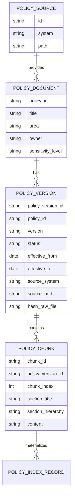
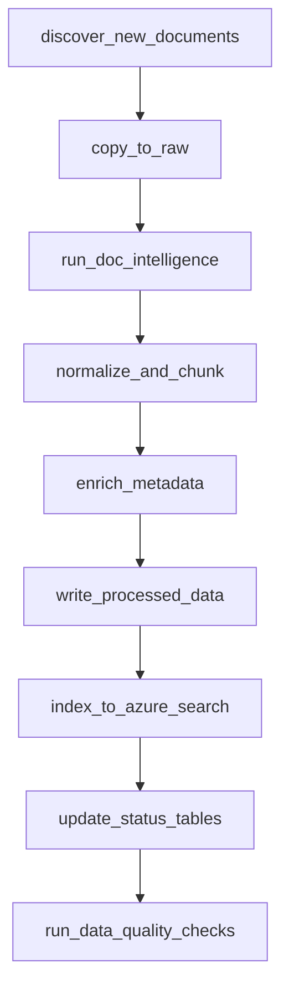

# Fase 2 — DataOps: Ingestão & Indexação

---

## 🧭 Breadcrumb

Home → Livro Técnico → **Fase 2 — DataOps: Ingestão & Indexação**

---

## 📌 Sumário da Fase 2

1. [Visão geral da Fase 2](#1-visão-geral-da-fase-2)
2. [Modelo de dados para políticas (nível DataOps)](#2-modelo-de-dados-para-políticas-nível-dataops)
3. [Fontes de dados & extração](#3-fontes-de-dados--extração)
4. [Landing Zone (raw) no Data Lake](#4-landing-zone-raw-no-data-lake)
5. [Pipeline de extração com Azure AI Document Intelligence](#5-pipeline-de-extração-com-azure-ai-document-intelligence)
6. [Normalização e preparação para chunking](#6-normalização-e-preparação-para-chunking)
7. [Estratégia de chunking](#7-estratégia-de-chunking)
8. [Enriquecimento com metadados](#8-enriquecimento-com-metadados)
9. [Persistência dos dados processados](#9-persistência-dos-dados-processados)
10. [Indexação em Azure AI Search](#10-indexação-em-azure-ai-search)
11. [Data Quality & QA da Fase 2](#11-data-quality--qa-da-fase-2)
12. [Tratamento de erros e retries](#12-tratamento-de-erros-e-retries)
13. [Performance & escalabilidade do pipeline](#13-performance--escalabilidade-do-pipeline)
14. [Segurança & compliance no pipeline de dados](#14-segurança--compliance-no-pipeline-de-dados)
15. [Orquestração DataOps (DAG, jobs, ambientes)](#15-orquestração-dataops-dag-jobs-ambientes)
16. [Versionamento de dados e lineage](#16-versionamento-de-dados-e-lineage)
17. [Observabilidade & monitoramento (DataOps)](#17-observabilidade--monitoramento-dataops)
18. [Artefatos da Fase 2 & Gate de saída](#18-artefatos-da-fase-2--gate-de-saída)

---
---
# 1. Visão geral da Fase 2

A Fase 2 é onde o Assistente de Políticas deixa de ser apenas "um agente inteligente" e passa a ser suportado por uma fundação sólida de **DataOps**. O objetivo é garantir que o agente **não invente políticas**, porque opera sobre uma base de dados robusta, versionada, auditável e monitorada.

### 🎯 Objetivo macro

Criar um pipeline de dados robusto que:

* Ingere políticas oficiais de múltiplas fontes (SharePoint, file server, portais legados etc.).
* Armazena tudo em um **data lake organizado** (`raw → extracted → processed`).
* Extrai texto e estrutura com **Azure AI Document Intelligence**.
* Normaliza, limpa, organiza em **chunks** e enriquece com metadados de negócio e técnicos.
* Indexa os dados em **Azure AI Search** com suporte completo a RAG (texto + vetores).
* Monitora **qualidade, cobertura e falhas** em nível de documento e chunk.

### ✅ Condição de “Fase 2 concluída”

A fase é considerada concluída quando:

* 100% das políticas do inventário da Fase 0 estão:

  * Ingeridas (raw),
  * Extraídas (texto + layout),
  * Normalizadas e chunkadas,
  * Indexadas em Azure AI Search.
* Existem métricas claras de:

  * **Coverage** (documentos e chunks),
  * **Qualidade de extração** (golden set),
  * **Atualização** (tempo entre alteração e disponibilidade).
* Os pipelines são **reprodutíveis**, **versionados** e possuem logs + alertas.

---
---
# 2. Modelo de dados para políticas (nível DataOps)

Antes de falar de pipelines, definimos **como os dados serão representados** ao longo do fluxo.

## 2.1 Entidades de dados

* **PolicySource** – Origem bruta (SharePoint, file server, portal, e-mail).
* **PolicyDocument** – Documento lógico de política (ex.: “Política de Férias”).
* **PolicyVersion** – Versão específica de um documento (v3.1, v4.0…).
* **PolicyChunk** – Trecho de texto usado no RAG (unidade mínima indexável).
* **PolicyIndexRecord** – Representação final, pronta para Azure AI Search.

### 🧊 Diagrama conceitual de dados



## 2.2 Esquema lógico (quase físico)

### Tabela `policy_documents`

* `policy_id` (PK) – Ex.: `POL-RH-FERIAS`.
* `title` – Nome da política.
* `area` – RH, Jurídico, Segurança, etc.
* `owner` – Pessoa/área responsável.
* `description` – Resumo curto.
* `sensitivity_level` – `INTERNAL | INTERNAL_RESTRICTED | CONFIDENTIAL`.
* `created_at`, `updated_at`.

### Tabela `policy_versions`

* `policy_version_id` (PK, uuid).
* `policy_id` (FK → `policy_documents`).
* `version` – Ex.: `"3.1"`.
* `status` – `DRAFT | ACTIVE | DEPRECATED`.
* `effective_from`, `effective_to` (nullable).
* `source_system` – SHAREPOINT, FILESYSTEM, etc.
* `source_path` – URL/caminho do arquivo.
* `hash_raw_file` – Checksum para detectar mudanças.
* `ingested_at`, `extracted_at`, `processed_at`, `indexed_at`.

### Tabela `policy_chunks`

* `chunk_id` (PK, uuid).
* `policy_version_id` (FK).
* `chunk_index` – Ordem do chunk no documento.
* `section_hierarchy` – Ex.: `["1. Objetivo", "1.2 Escopo"]`.
* `section_title` – Título da seção principal.
* `content` – Texto puro, limpo.
* `tokens_count` – Nº de tokens aproximado.
* `language` – Ex.: `"pt-BR"`.
* `sensitivity_level` – Repetido para facilitar filtros.
* `created_at`.

> **Observação:** a embedding pode ficar numa coluna separada (para DBs com suporte vetorial) ou ser calculada na etapa de indexação do Azure AI Search.

## 2.3 Índice `policy-index` no Azure AI Search

Campos essenciais:

* `id` – `chunk_id`.
* `policy_id`, `policy_version`, `policy_title`.
* `area`, `sensitivity_level`.
* `effective_from`, `effective_to`.
* `section_title`, `section_hierarchy`.
* `content`.
* `source_url`.
* `language`.
* `embedding` – Campo vetorial.

---
---
# 3. Fontes de dados & extração

## 3.1 Tipos de fontes

* **SharePoint / OneDrive / Teams** – Bibliotecas de documentos (PDF, DOCX).
* **File Server on-prem** – Diretórios de políticas antigas.
* **Sistemas legados / Portais** – Páginas HTML exportadas.
* **E-mails históricos (opcional)** – Comunicados importantes convertidos em documentos.

## 3.2 Padrões de ingestão

* **Full Load inicial**:

  * Ingesta todas as políticas listadas no inventário da Fase 0 para `raw/`.
* **Incremental (delta)**:

  * Executado periodicamente (por exemplo, 1x/dia).
  * Detecta novos arquivos e mudanças via `hash_raw_file`.

## 3.3 Conectores concretos

* **SharePoint**:

  * Azure Data Factory com conector nativo ou
  * Scripts Python usando Microsoft Graph API.
* **File Server**:

  * Data Factory com Self-hosted Integration Runtime ou
  * Serviço on-prem que envia para Blob Storage.
* **Outros sistemas**:

  * APIs HTTP → pipelines Data Factory/Airflow/n8n.

## 3.4 Metadados na ingestão

Ao mover um arquivo para `raw/`, registrar:

* `source_system`, `source_path`.
* `policy_id` (se já mapeado) ou identificador temporário.
* `ingested_on`.
* `hash_raw_file`.

---
---
# 4. Landing Zone (raw) no Data Lake

Estrutura recomendada em Blob Storage / ADLS Gen2:

```text
/policies/
  raw/
    sharepoint/
      RH/
        POL-RH-FERIAS/
          POL-RH-FERIAS_v3.1_20240101.pdf
      Juridico/
      Seguranca/
    filesystem/
    ...
  extracted/
    ... (JSON + texto extraído)
  processed/
    chunks/
      year=2024/month=01/
        POL-RH-FERIAS_v3.1_chunk_0001.json
        POL-RH-FERIAS_v3.1_chunk_0002.json
```

### Convenções de nomes

* Arquivo raw: `<policy_id>_v<version>_<effective_from>.ext`.
* Metadados do Blob:

  * `x-policy-id`, `x-policy-version`, `x-area`, `x-sensitivity`.

Essas convenções facilitam:

* Auditoria.
* Reprocessamento seletivo.
* Filtros por área/sensibilidade no próprio armazenamento.

---
---
# 5. Pipeline de extração com Azure AI Document Intelligence

## 5.1 Escolha de modelo

* **Modelos pré-treinados**:

  * `prebuilt-document` para documentos gerais.
* **Modelos customizados** (se layout for padronizado):

  * Extraem campos específicos (ex.: “Objetivo”, “Escopo”, “Definições”).

## 5.2 Fluxo de extração

Para cada arquivo em `raw/`:

1. Ler do Blob.
2. Enviar para Document Intelligence.
3. Receber:

   * Texto completo.
   * Layout (páginas, parágrafos, tabelas, seções).
   * Estrutura em JSON.
4. Persistir em `extracted/`:

   * `*.json` com estrutura completa.
   * `*.txt` opcional com texto linear.

## 5.3 Tratamento de formatos

* **PDF**:

  * Atenção a colunas, cabeçalhos/rodapés repetidos.
* **DOCX**:

  * Converter para PDF ou enviar direto, se suportado.
* **Imagens (scans)**:

  * OCR nativo do serviço.
  * Maior esforço de QA.

## 5.4 Limpeza pós-extração

Regras típicas:

* Remover cabeçalhos/rodapés repetitivos.
* Normalizar quebras de linha para parágrafos coerentes.
* Remover caracteres estranhos (NBSP, etc.).
* Padronizar listas, bullets e numerações.

---
---
# 6. Normalização e preparação para chunking

## 6.1 Identificação de seções

A partir do JSON de Document Intelligence:

* Detectar headings por:

  * Padrões `1.`, `1.1`, `1.1.1` etc.
  * Estilo tipográfico (H1, H2, negrito, tamanho).
* Construir uma **árvore de seções** com título, número e texto.

### Exemplo de árvore

```json
{
  "title": "Política de Férias",
  "sections": [
    {
      "number": "1",
      "title": "Objetivo",
      "text": "...",
      "children": []
    },
    {
      "number": "2",
      "title": "Elegibilidade",
      "text": "...",
      "children": [
        {
          "number": "2.1",
          "title": "Colaboradores CLT",
          "text": "...",
          "children": []
        }
      ]
    }
  ]
}
```

## 6.2 Correções semi-automáticas

Heurísticas:

* Parágrafos iniciados por `a)`, `b)`, `c)` → herdarem o heading anterior.
* Juntar parágrafos quebrados por diagramação.

## 6.3 Limpeza de PII (opcional)

Se houver exemplos com dados pessoais:

* Detectar PII via Azure Cognitive Services ou regex.
* Substituir por placeholders (`<NOME>`, `<CPF>` etc.).

---
---
# 7. Estratégia de chunking

## 7.1 Objetivos

Cada **PolicyChunk** deve:

* Fazer sentido sozinho.
* Ser específico o suficiente para perguntas pontuais.
* Não “explodir” tokens.
* Preservar contexto de seção/hierarquia.

## 7.2 Abordagens

### Modo A — Chunk por seção com limite de tokens

* Para cada seção:

  * Concatenar parágrafos até `min_tokens` (ex.: 100).
  * Não ultrapassar `max_tokens` (ex.: 400–500).
  * Se ultrapassar, dividir respeitando parágrafos/frases.

### Modo B — Sliding window

* Usar janela deslizante com sobreposição:

  * `max_tokens = 400`, `overlap = 80`.
* Vantagens:

  * Mais contexto, porém mais custo (mais chunks).

## 7.3 Campos do chunk

* `chunk_id`
* `policy_version_id`
* `chunk_index`
* `section_hierarchy`
* `section_title`
* `content`
* `tokens_count`
* `sensitivity_level`
* `effective_from`, `effective_to`
* `source_url`

## 7.4 Pseudo-algoritmo de chunking

```python
for policy_version in ACTIVE_POLICIES:
    sections_tree = parse_sections(policy_version.extracted_json)
    chunk_index = 0
    for section in sections_tree:
        buffer = ""
        buffer_tokens = 0
        for paragraph in section.paragraphs:
            tokens = count_tokens(paragraph)
            if buffer_tokens + tokens > MAX_TOKENS:
                yield_chunk(policy_version, section, chunk_index, buffer)
                chunk_index += 1
                buffer = paragraph
                buffer_tokens = tokens
            else:
                buffer += "\n" + paragraph
                buffer_tokens += tokens
        if buffer:
            yield_chunk(policy_version, section, chunk_index, buffer)
            chunk_index += 1
```
---
---

# 8. Enriquecimento com metadados

## 8.1 Metadados de negócio (da Fase 0)

Vêm do inventário de políticas:

* `policy_id`, `title`, `area`, `owner`.
* `sensitivity_level`.
* `effective_from`, `effective_to`.

São propagados para:

* `policy_versions`.
* `policy_chunks`.
* `policy_index` (Azure Search).

## 8.2 Metadados técnicos

* `hash_raw_file`.
* `extraction_engine_version` (ex.: `docAI_v2025-01`).
* `chunking_algorithm_version` (ex.: `chunk_v1.2`).
* `pipeline_run_id` (identificador do job).

Isso permite:

* Saber qual versão de algoritmo gerou cada chunk.
* Refazer indexação de forma seletiva quando o algoritmo evoluir.

---
---
# 9. Persistência dos dados processados

## 9.1 Formatos físicos

Recomendado:

* **Parquet** para análises (Spark/Synapse).
* **JSONL** para indexação.

Exemplo:

```text
processed/
  chunks/
    year=2025/month=01/
      policy_chunks_20250101.parquet
      policy_chunks_20250101.jsonl
```

## 9.2 Estrutura JSONL para indexação

Cada linha representa um `PolicyIndexRecord`:

```json
{
  "id": "chunk-uuid",
  "policy_id": "POL-RH-FERIAS",
  "policy_version": "3.1",
  "policy_title": "Política de Férias",
  "area": "RH",
  "sensitivity_level": "INTERNAL",
  "effective_from": "2024-01-01",
  "effective_to": null,
  "section_title": "Direito a férias",
  "section_hierarchy": ["2. Elegibilidade", "2.1 Colaboradores CLT"],
  "content": "Texto completo do chunk...",
  "source_url": "https://.../POL-RH-FERIAS_v3.1.pdf",
  "language": "pt-BR",
  "embedding": null,
  "chunk_index": 5,
  "pipeline_run_id": "run-2025-01-10T10:00:00Z"
}
```
---
---

# 10. Indexação em Azure AI Search

## 10.1 Design do índice

* Nome: `policy-index-v1` (já pensando em versões futuras).
* Campos:

  * `id` (key).
  * `policy_id`, `policy_title`, `policy_version`, `area`, `sensitivity_level`.
  * `effective_from`, `effective_to`.
  * `section_title`, `section_hierarchy`.
  * `content`, `source_url`, `language`.
  * `embedding` (campo vetorial).

## 10.2 Configuração vetorial

* Algoritmo: **HNSW**.
* Dimensão: conforme o modelo de embedding.
* Modelo de embedding:

  * Ex.: `text-embedding-3-small` (Azure OpenAI).

## 10.3 Skillset & Indexer (Opção A – indexador automático)

* **Skillset**:

  * Skill de embedding que gera vetores a partir de `content`.
* **Indexer**:

  * Input: arquivos JSONL em `processed/chunks/`.
  * Output: `policy-index-v1`.
  * Schedule: por exemplo, a cada 1 hora.

## 10.4 Indexação “push” (Opção B – via código)

* Pipeline lê Parquet/JSONL.
* Calcula embedding via Azure OpenAI.
* Usa a API de batch do Azure Search para enviar documentos.

## 10.5 Atualização do índice

* Quando uma `policy_version` se torna `ACTIVE`:

  * Indexar seus chunks.
* Versões `DEPRECATED`:

  * Remover do índice ou marcar como inativas.
* Regra base:

  * Somente `policy_versions` com `status = ACTIVE` entram no RAG.

---
---
# 11. Data Quality & QA da Fase 2

## 11.1 Testes por etapa do pipeline

1. **Ingestão (raw)**

   * Testes:

     * Todos os documentos do inventário foram ingeridos?
     * Hash dos arquivos confere?
   * Métricas:

     * `coverage_policies_raw = docs_ingestados / docs_inventário`.

2. **Extração (Document Intelligence)**

   * Testes:

     * Conjunto de documentos "golden".
     * Checar se o texto extraído cobre > X% do texto original.
     * Verificar se headings principais foram detectados.

3. **Normalização & chunking**

   * Testes:

     * Nenhum chunk com `content` vazio.
     * `tokens_count` dentro de um intervalo aceitável.
     * Cada `policy_version` ativa tem pelo menos 1 chunk.

4. **Enriquecimento**

   * Testes:

     * Todos os chunks têm `policy_id`, `policy_version`, `sensitivity_level`, `effective_from`.
     * `effective_from <= effective_to` (se não nulo).

5. **Indexação**

   * Testes:

     * Número de documentos no índice ≈ número de chunks processados (dentro de uma tolerância).
     * Buscar por `policy_id` e verificar retorno.

## 11.2 Golden set de QA

* Selecionar 3–5 políticas críticas (férias, home office, jornada etc.).
* Validar manualmente, para cada uma:

  * Extração de texto.
  * Estrutura de seções.
  * Chunks gerados.

## 11.3 Métricas de qualidade

* `coverage_policies = #policy_versions_indexadas / #policy_versions_ativas`.
* `coverage_chunks = #chunks_indexados / #chunks_processados`.
* `avg_chunk_length_tokens`.
* `golden_doc_extraction_score` (0–1).
* `golden_doc_chunk_quality_score` (0–1, avaliação humana).

---
---
# 12. Tratamento de erros e retries

## 12.1 Tipos de erro

* Falha de conexão com fonte (SharePoint/file server).
* Erros da API do Document Intelligence.
* Documentos com layout corrompido/scans ruins.
* Falhas de gravação em `processed/`.
* Falhas na indexação.

## 12.2 Estratégia de resiliência

* **Retries com backoff exponencial** para erros transitórios.
* **Dead-letter / Quarantine** para documentos com falha repetida:

  * Mover para `quarantine/`.
  * Registrar em `failed_documents` (motivo, timestamp, tentativa).
* **Flags de status** em `policy_versions`:

  * `extraction_status`: `PENDING | OK | FAILED`.
  * `processing_status`.
  * `indexing_status`.

Isso permite:

* Identificar gargalos.
* Reprocessar apenas o que falhou.

---
---
# 13. Performance & escalabilidade do pipeline

## 13.1 Volume esperado

* Nº de políticas geralmente < 500.
* Tamanho médio moderado, com atualizações pouco frequentes.

## 13.2 Estratégias de escalabilidade

* **Paralelização**:

  * Processar documentos em paralelo por área ou política.
* **Batch vs streaming**:

  * Ingestão e indexação por lotes (batch diário/horário).
* **Tuning de custo**:

  * Rodar extração apenas quando `hash_raw_file` mudar.
  * Reutilizar embeddings para chunks não alterados.

---
---
# 14. Segurança & compliance no pipeline de dados

## 14.1 Governança de acesso

* Storage acessado com **Managed Identity**.
* Bloqueio de acesso anônimo.
* Document Intelligence com chaves em **Key Vault**.
* Metadados acessíveis apenas por time de DataOps e aplicação.

## 14.2 Logs & proteção de dados sensíveis

* Evitar armazenar texto completo de políticas confidenciais em logs.
* Quando necessário, logar apenas:

  * Hash do documento.
  * Trechos truncados.
  * IDs e metadados, nunca conteúdo completo.

---
---
# 15. Orquestração DataOps (DAG, jobs, ambientes)

## 15.1 Orquestrador

Ferramentas possíveis:

* Azure Data Factory / Synapse Pipelines.
* Airflow.
* n8n.

Idealmente, escolher **um orquestrador principal** para o pipeline central.

## 15.2 DAG do pipeline

### Tarefas principais

1. `discover_new_documents`
2. `copy_to_raw`
3. `run_doc_intelligence`
4. `normalize_and_chunk`
5. `enrich_metadata`
6. `write_processed_data`
7. `index_to_azure_search`
8. `update_status_tables`
9. `run_data_quality_checks`

Cada tarefa deve:

* Ter retries configurados.
* Escrever logs detalhados.

### Diagrama de fluxo do pipeline (Mermaid)



## 15.3 Ambientes

* **dev**: subset pequeno de políticas.
* **staging**: espelho amplo do inventário.
* **prod**: inventário completo.

Configurações (endpoints, índices, storage) segregadas por ambiente.

---
---

# 16. Versionamento de dados e lineage

## 16.1 Versionamento de documento e pipeline

Para cada `policy_version`, registrar:

* `pipeline_run_id`.
* `extraction_engine_version`.
* `chunking_algorithm_version`.
* `index_version` (ex.: `policy-index-v1`).

## 16.2 Lineage

Idealmente, usar um **Data Catalog** para registrar:

* Fonte → raw → extracted → processed → índice.

Perguntas que o lineage precisa responder:

* “Essa resposta do agente veio de qual versão de política?”
* “Qual run de pipeline gerou esses chunks?”

---
---

# 17. Observabilidade & monitoramento (DataOps)

## 17.1 Métricas

* `documents_ingested_count` (por dia).
* `documents_extracted_ok` vs `documents_extracted_failed`.
* `chunks_generated_count`.
* `index_documents_count`.
* `pipeline_latency` (tempo médio para um documento ficar disponível).
* `policy_coverage`.

## 17.2 Dashboards

Em Power BI / Grafana / Azure Monitor, criar painéis como:

* **Painel DataOps**:

  * Nº de políticas por status (PENDING, OK, FAILED).
  * Tempo médio de extração.
  * Tempo entre upload e disponibilização no índice.

* **Painel de qualidade**:

  * Score dos golden docs.
  * Nº de documentos em `quarantine`.

## 17.3 Alertas

Disparar alertas quando:

* `policy_coverage < 95%`.
* Falhas de extração > X em 24h.
* Última execução bem-sucedida do pipeline > N horas.

---
---

# 18. Artefatos da Fase 2 & Gate de saída

## 18.1 Artefatos esperados

* `22-data-model-policies.md`

  * Tabelas/coleções: `policy_documents`, `policy_versions`, `policy_chunks`.
* `23-datalake-layout.md`

  * Estrutura de pastas `raw/`, `extracted/`, `processed/`.
* `24-document-intelligence-spec.md`

  * Modelos, parâmetros, exemplos de saída.
* `25-chunking-strategy.md`

  * Algoritmos, parâmetros, diagramas.
* `26-azure-search-index-design.md`

  * Campos, tipos, configurações vetoriais.
* `27-dataops-pipeline-dag.md`

  * DAG, dependências, regras de retry.
* `28-data-quality-tests.md`

  * Testes automáticos, métricas, golden set.
* `29-dataops-monitoring-and-alerts.md`
* `30-data-lineage-and-versioning.md`

## 18.2 Critérios GO/NO-GO da Fase 2

### ✅ GO se:

* Pelo menos **95% das `policy_versions` ativas** estão:

  * Ingeridas,
  * Extraídas,
  * Chunkadas,
  * Indexadas.
* O golden set atinge o **score mínimo definido** para extração e chunking.
* O pipeline é:

  * Reexecutável,
  * Monitorado,
  * Com alertas configurados.
* Donos de políticas (RH/Jurídico/Segurança) validaram pelo menos **1–2 documentos por área**.

### ❌ NO-GO se:

* Há divergência significativa entre inventário e índice (políticas "sumidas").
* Existem erros graves de extração em políticas críticas.
* Não há forma de monitorar novas versões de políticas ou detectar falhas do pipeline.

---

👉 **Próximo capítulo:** [Fase 3 — Implementação do Backend, Agentes e API](#) (link será ajustado para o arquivo `Fase3.md` quando criado).
